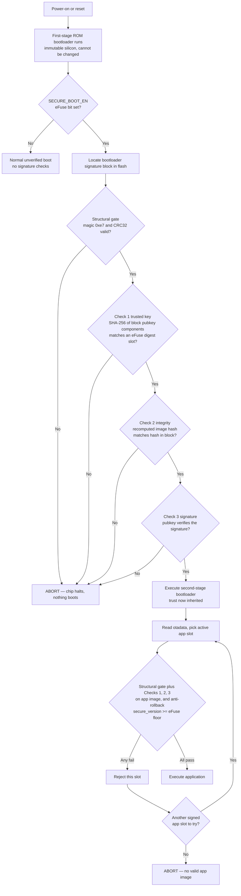
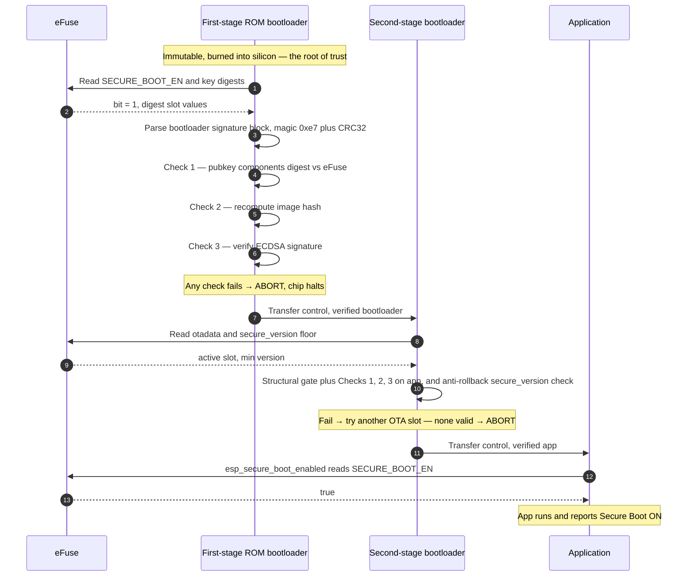
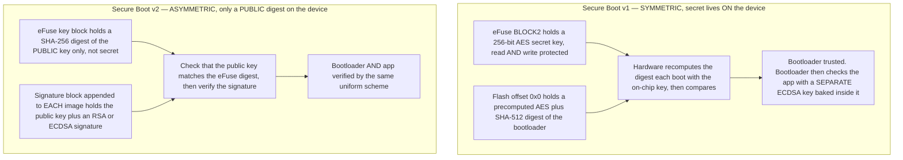
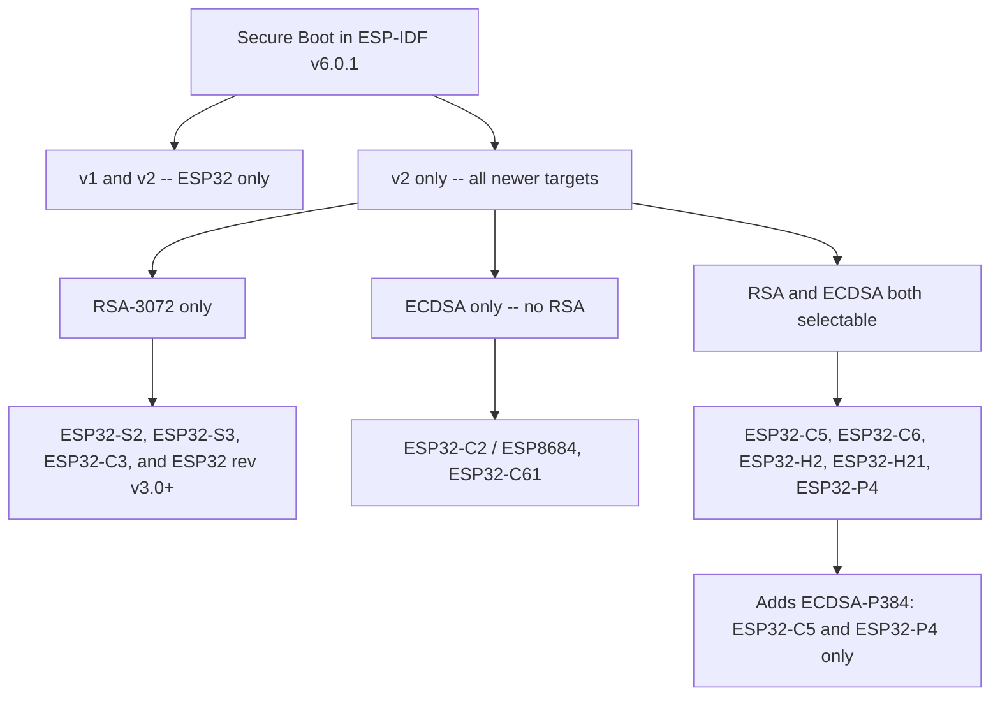
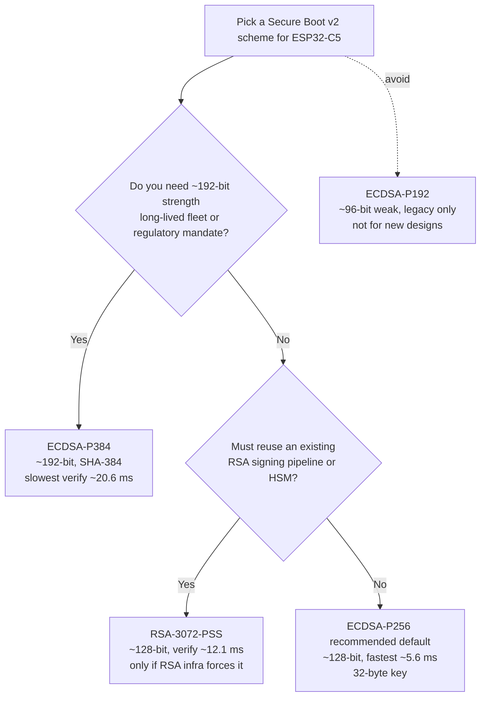
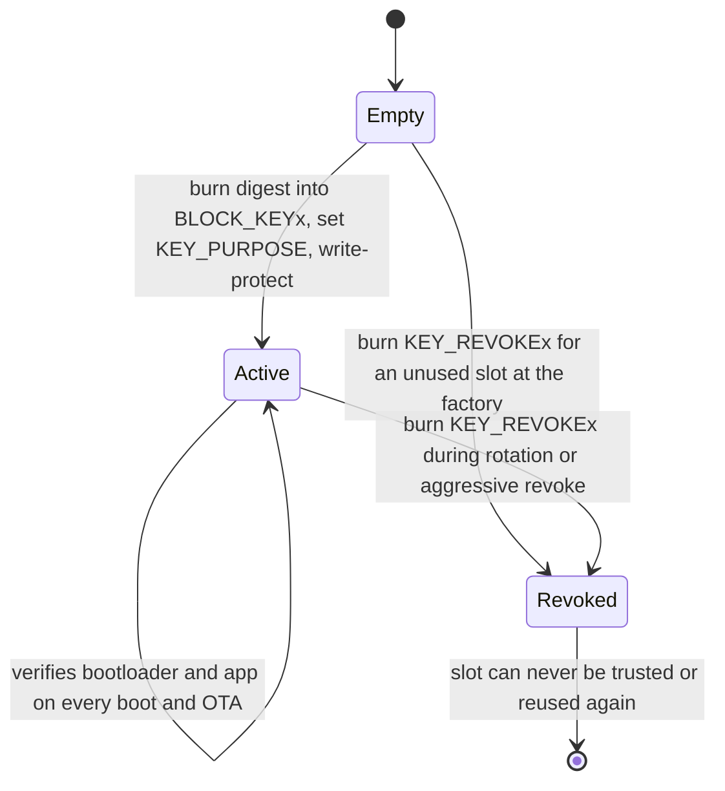
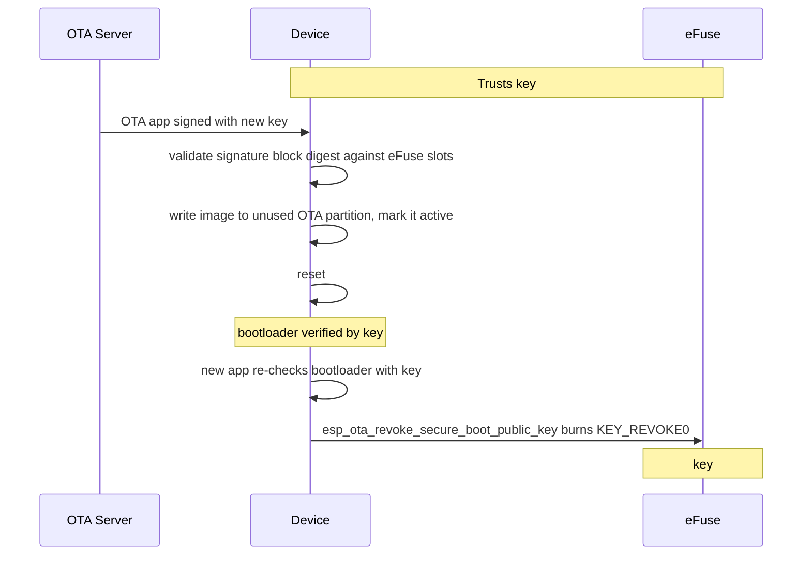
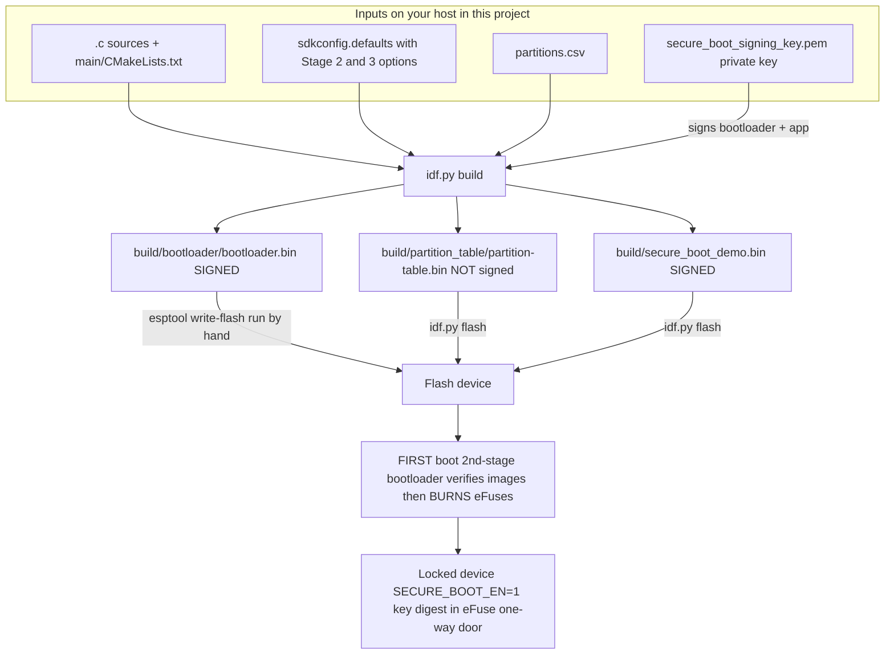
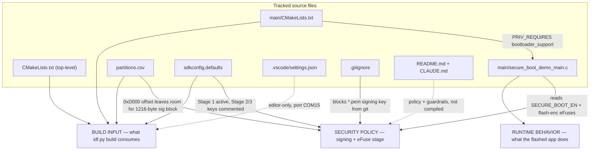
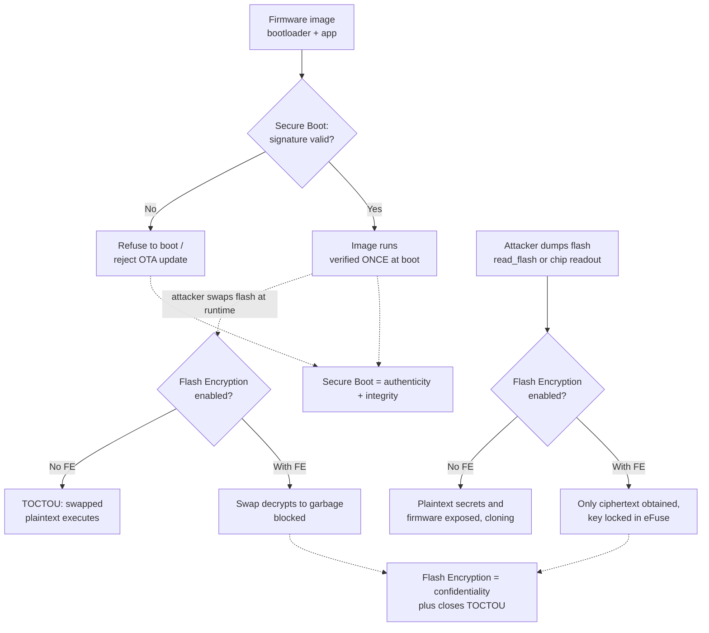

# ESP32 Secure Boot v2 — Architecture, Configuration, and Operation

> **Overview.** A self-contained treatment of Secure Boot on the ESP32 family,
> spanning boot-time image verification, the underlying signature schemes, the
> eFuse bits that enforce the chain of trust, and the associated key management.
> The material progresses from the conceptual model through the exact hardware
> mechanisms and the build pipeline that produces signed images. All claims were
> validated against the **local ESP-IDF v6.0.1 security documentation** installed
> on this machine.

### How to read this

- **§1–§2** establish the conceptual model: the boot-time verification flow and the distinction between Secure Boot v1 and v2.
- **§3** provides the chip-support reference — which ESP32 variants support which features.
- **§4–§6** cover the mechanics: signature schemes, eFuses and key storage, and the build pipeline.
- **§7** maps these mechanisms onto the files in this project.
- **§8** presents the threat model and the limits of Secure Boot used in isolation.
- **§9** is a glossary defining each term precisely.

### Diagram legend

Flowcharts, sequence diagrams, and state machines are expressed in **Mermaid**,
which GitHub and most Markdown previewers render automatically. In a plain text
editor they appear as fenced `mermaid` code blocks; the adjacent ASCII box
diagrams depict the same flow. Names in `MONOSPACE` (e.g. `SECURE_BOOT_EN`,
`BLOCK_KEYx`) are literal eFuse or configuration identifiers and can be searched
for directly.

> ⚠️ **Irreversibility.** Enabling *hardware* Secure Boot burns eFuses
> **permanently**; the operation cannot be undone. Review §5 before applying it to
> a physical board. All steps prior to that point are reversible.

---

## Table of contents

1. [The boot-time chain of trust](#1-the-boot-time-chain-of-trust) — what happens at every power-on
2. [Secure Boot v1 vs v2](#2-secure-boot-v1-vs-v2) — two completely different designs
3. [The whole ESP32 family and who supports what](#3-the-whole-esp32-family-and-who-supports-what) — the support matrix
4. [Signature schemes compared](#4-signature-schemes-compared) — RSA-3072 vs ECDSA P-192 / P-256 / P-384
5. [eFuses, keys, rotation and revocation](#5-efuses-keys-rotation-and-revocation) — what physically gets burned
6. [The build, sign and flash pipeline](#6-the-build-sign-and-flash-pipeline) — from source to a locked device
7. [Every file in this project and its data](#7-every-file-in-this-project-and-its-data) — per-file map
8. [Threat model and why you also need Flash Encryption](#8-threat-model-and-why-you-also-need-flash-encryption)
9. [Glossary of terms](#9-glossary-of-terms) — every new term, defined

---


## 1. The boot-time chain of trust

Secure Boot v2 structures power-on as a sequence in which each stage cryptographically verifies the next before transferring control to it. No stage executes until the stage that preceded it has proven the next stage genuine. The sequence is anchored in a component that cannot be tampered with — the ROM — so the entire chain inherits its trust from immutable silicon. The following subsections describe each link, each verification check, and each failure mode.

> 🖱️ **Interactive version.** An animated, step-through rendering of this flow — including a *tamper the app image* mode that drives the failure path to an abort — is provided as [`secure-boot-flow.html`](./secure-boot-flow.html). The file is self-contained; open it in any browser.

### 1.1 The anchor: immutable ROM + eFuse

A chain of trust requires a first link that is trusted *by construction* rather than by verification; otherwise the verifier would itself require a verifier without end. On the ESP32-C5 that anchor is the **first-stage (ROM) bootloader**: code fixed into the chip's mask ROM at manufacture. It is read-only silicon, so an attacker with full flash-write access cannot alter it. Because it can never change, it does not itself require a signature — it is the *root of trust*.

Two values are burned into **eFuse** (one-time-programmable fuse bits inside the chip) to arm the chain:

- **`SECURE_BOOT_EN`** — a single bit. When set, the ROM refuses to run any unverified second-stage bootloader.
- **Up to three public-key digest slots** — each holds a **32-byte SHA-256 digest of the trusted public-key components**, not the key material itself and never the private key. Key rotation and revocation operate on these slots via the `KEY_REVOKEx` fuses.

A precise definition of that digest is warranted, as it is a common source of confusion: the eFuse value is *not* a hash of the bare public key. It is a SHA-256 computed over the **776-byte public-key components block** carried inside the signature block. For the RSA scheme that block spans signature-block offsets 36–812 and includes the modulus, the exponent, and the precomputed **R** and **M'** Montgomery values used to accelerate verification; for ECDSA it is the public-key point. Hashing only the raw key would *not* reproduce the eFuse digest — the ROM hashes the same components block it will later use to verify.

The private signing key **never touches the device**. Only the *public* key travels with each image (inside its signature block), and eFuse stores only a short *digest* (hash) of that public key's components. This allows the ROM to answer the question "is this the key I was told to trust?" inexpensively, without storing a large key on-chip.

```
        ┌─────────────────────────────────────────────────────────┐
        │  IMMUTABLE SILICON  (root of trust — cannot be rewritten) │
        │                                                           │
        │   First-stage ROM bootloader      eFuse                   │
        │                              ┌──────────────────────┐     │
        │                              │ SECURE_BOOT_EN = 1    │     │
        │                              │ digest slot 0/1/2     │     │
        │                              │ (SHA-256 of pubkey    │     │
        │                              │  components block)    │     │
        │                              └──────────────────────┘     │
        └───────────────┬───────────────────────────────────────────┘
                        │ verifies (3 checks) before trusting
                        ▼
        ┌───────────────────────────────┐   each stage carries an
        │  2nd-stage bootloader (flash)  │   appended SIGNATURE BLOCK:
        │  + signature block             │   full public key + signature
        └───────────────┬───────────────┘
                        │ verifies (3 checks) before trusting
                        ▼
        ┌───────────────────────────────┐
        │  Application image (OTA slot)  │
        │  + signature block             │
        └───────────────────────────────┘
```

The link between silicon and flash is one-directional trust: the immutable side reads the mutable side, hashes it, and compares the result against a value it cannot be deceived about (the eFuse digest). Flash can misrepresent its contents, but it cannot misrepresent its way past a hash that must match a fuse.

### 1.2 What "verify an image" actually means — three checks

Every link performs the **same** verification routine on the next image: first an inexpensive **structural gate**, then three **cryptographic checks**. All must pass, in order.

**Structural gate (is this even a signature block?):** the block is valid only if its first byte is the magic `0xe7` and the CRC32 at offset 1196 is correct. A malformed or missing block fails here immediately.

The three checks follow — the core of the scheme:

| # | Question it answers | How it's checked | Data compared |
|---|---------------------|------------------|----------------|
| **1** | **Is this a trusted key?** | SHA-256 the **public-key components** in the image's signature block (the same 776-byte block hashed at enrollment); compare against the digest(s) in eFuse. No match against *any* slot → fail. | block's pubkey-components hash ⟷ eFuse digest slot(s) |
| **2** | **Is the image intact?** | Recompute the hash over the raw image bytes read from flash; compare to the hash stored in the signature block. Any flipped bit → fail. | recomputed image hash ⟷ hash field in block |
| **3** | **Is the signature genuine?** | Use the now-trusted public key to verify the signature over the image digest. Only the holder of the matching *private* key could have produced it. | signature ⟷ digest, under the public key |

On the C5 with **ECDSA-256** (this demo's scheme) the image digest in checks 2/3 is **SHA-256**, and check 3 is ECDSA verification per RFC 6090 §5.3.3. With **ECDSA-384** it would be **SHA-384** instead (and the `SECURE_BOOT_SHA384_EN` fuse is set). RSA-3072 uses RSA-PSS per RFC 8017 §8.1.2. The eFuse *key* digest remains 32-byte SHA-256 regardless of scheme.

The three checks are distinct because they defend against distinct attacks. Check 1 stops an attacker who re-signs an image with **their own** key (correct structure, wrong key). Check 2 stops **tampering** with an otherwise-signed image (correct key, corrupted bytes). Check 3 stops a **forged signature** (an attempt to match the key digest, but without the private key). Omitting any one collapses the scheme.

> Order matters for one subtlety: *aggressive key revocation* revokes a key only when **check 3** fails (a genuine-looking key that cannot produce a valid signature). A mere bad block or bad hash (structural gate or check 2) does **not** revoke a key.

### 1.3 Link 1 — ROM verifies the second-stage bootloader

At every power-on or reset:

1. ROM reads `SECURE_BOOT_EN`. If clear → normal unverified boot (nothing below applies). If set → continue.
2. ROM locates the bootloader's signature block in flash and runs the **structural gate** (magic `0xe7` + CRC32).
3. ROM runs **checks 1 → 2 → 3** against the eFuse digest(s).
4. **Any failure → the boot is aborted; the chip halts.** There is no "run it anyway" path — a bootloader that fails verification never executes.
5. All pass → ROM transfers control to the second-stage bootloader.

The bootloader is **not OTA-upgradeable** and is signed in the factory (optionally with several keys, so future keys survive a revocation). Because the ROM has already proven it authentic, the bootloader now *inherits* the root of trust and becomes the verifier for the next link.

### 1.4 Link 2 — the bootloader verifies the app (and the OTA path)

The verified bootloader repeats the same routine one level up, with two additional considerations that matter for field devices — **OTA fallback** and **anti-rollback**:

1. Read `otadata` to select the currently active OTA app slot.
2. Run the **structural gate + checks 1/2/3** on the app image, **and** — if anti-rollback is enabled — apply the anti-rollback gate as part of determining whether the slot is bootable: the app's `secure_version` in its header must be **≥** the security version stored in eFuse. A correctly-signed but *outdated* app (for example, one carrying a since-revoked credential) is rejected even though its signature is perfectly valid. This `secure_version` check is enforced by the 2nd-stage bootloader at both boot-up and over-the-air updates. On the C5 the `secure_version` eFuse field is **9 bits**, so the anti-rollback floor can advance at most 9 times over the device's life, and it only ever moves upward.
3. **On failure, fall back:** unlike the bootloader (which simply halts), the bootloader will look for **another** correctly-signed, version-acceptable app image in a different OTA slot and try again. This repeats until a valid image is found or none remain.
4. If **no** slot yields a valid, version-acceptable, correctly-signed image → boot is aborted.
5. On success → control transfers to the application, which is then free to report status (for example, `esp_secure_boot_enabled()` returning true).

This fallback is what allows Secure Boot to survive a failed OTA: a corrupted or wrongly-signed update cannot brick the device, because the previously-good slot still verifies. Key rotation follows the same path — sign the new app with a new key, boot it, then call `esp_ota_revoke_secure_boot_public_key()` to burn `KEY_REVOKE` on the old one.

### 1.5 The full decision tree



### 1.6 The same story as a hand-off sequence



### 1.7 Failure behavior at a glance

| Link | Verifier | On any check failure | Notable |
|------|----------|----------------------|---------|
| ROM → bootloader | Immutable ROM | **Halt.** No fallback — a bad bootloader never runs. | Bootloader is factory-flashed, not OTA-upgradeable |
| Bootloader → app | Verified bootloader | **Try the other OTA slot;** abort only if no slot verifies. | Adds an anti-rollback `secure_version` gate in addition to the crypto checks |

The essential principle is that **trust flows strictly downhill from unchangeable silicon.** The ROM trusts nothing in flash until three cryptographic checks pass; the bootloader — itself running only *because* it passed those checks — applies identical scrutiny to the app. A single altered bit anywhere below the ROM changes an image's hash, breaks check 2 (or the signature in check 3), and stops the boot. At no point in the sequence is unverified code trusted "just this once."


---

## 2. Secure Boot v1 vs v2

Espressif has shipped **two entirely different Secure Boot designs**. They are not successive revisions of a single scheme; they rest on opposite cryptographic philosophies that happen to share a name. Understanding the reason they differ is the most direct route to understanding what Secure Boot protects.

The single most important difference is **what resides on the chip**:

- **v1 keeps a SECRET on the device** (a symmetric AES key). Any party holding that secret can both *create* and *verify* trusted images. The value that proves authenticity must therefore never leak, yet it resides inside the chip shipped to customers.
- **v2 keeps only a PUBLIC value on the device** (the digest of a public key). The device can *verify* but can never *create* a trusted image. The secret that signs images (the private key) remains on the build server or HSM and never touches the hardware.

> Terminology: an **eFuse** is a one-time-programmable bit inside the chip — once burned to 1 it remains 1 permanently. A **digest** is a fixed-size fingerprint (a hash) of some data. **Symmetric** cryptography uses one shared secret for both sides; **asymmetric** (public-key) cryptography uses a private key to sign and a matching public key to verify. **Secure Boot v1 exists only on the original ESP32; from ESP32 chip revision v3.0 onward Espressif's preferred scheme is v2, and the ESP32-C5 implements v2 only.**

### The core mental model



The left side contains a secret; the right side does not. Nearly every practical advantage of v2 follows from that single fact.

### How v1 works (and where it hurts)

On first boot, v1 hardware generates a random **256-bit AES key**, writes it into eFuse **BLOCK2**, and read/write-protects it so software can never read it back. It then computes a **digest** of the second-stage bootloader (AES-256 in ECB mode over the image, prefixed with a 128-byte IV, finished with SHA-512 — a 192-byte result) and stores that digest at flash offset `0x0`. Burning the **`ABS_DONE_0`** eFuse locks Secure Boot on. On every subsequent boot, dedicated hardware recomputes the digest using the hidden key and compares it to the stored value; the computed digest is never exposed to software.

This hardware mechanism directly anchors **only the bootloader**. The *application* is verified separately: the bootloader carries an **ECDSA public key** (deterministic ECDSA per RFC 6979, curve NIST256p / `prime256v1`, SHA-256) and uses it to check a 68-byte signature appended to the partition table and app. v1 therefore does build a chain of trust to the app, but through **two different crypto systems** combined, with the root of trust being a symmetric secret.

That design carries structural weaknesses:

- **The secret resides on the device.** Because the AES key is computed with and stored on the chip, the scheme is theoretically exposed to **passive side-channel attacks** (observing timing or power draw while the hardware processes the secret). A public-key scheme has nothing secret to leak.
- **Exactly one key, no revocation.** Should the signing key ever be compromised, there is no mechanism to retire it and migrate to a new one; the device trusts that single key for its lifetime.
- **An awkward key-distribution tradeoff.** v1 offers two modes: **One-Time Flash** gives each device a unique key that never leaves it (but the bootloader can then *never* be updated), while **Reflashable** permits bootloader updates but derives the key from the ECDSA signing key — meaning a single leaked key can compromise an entire fleet.
- **Greater complexity** to reason about (an AES digest for the bootloader *plus* ECDSA signatures for the app), and it is **ESP32-only, superseded by v2**.

### How v2 works (and why it is cleaner)

v2 removes the on-device secret entirely. An asymmetric key pair is generated; the **private key never touches the device**. Each image (the bootloader and every app) receives a **signature block** appended — a 1216-byte structure containing the **public key** and an **RSA-3072-PSS** or **ECDSA** signature over the image. The only value burned into eFuse is the **SHA-256 digest of the public key**, which is not secret and can be published freely.

At boot, the ROM (for the bootloader) and the bootloader (for the app) run the **same** two-step check: confirm the public key in the signature block matches a digest stored in eFuse, then verify the signature over the image with that key. Because the check is identical for bootloader and app, v2 protects the **whole chain uniformly**, and the same verification also runs on **every OTA update** — if a freshly downloaded app fails verification, the bootloader falls back to another valid image rather than bricking the device.

Because no secret resides on the device, v2 is **immune to passive side-channel attacks by design**. And because eFuse holds up to **three** public-key digest slots, v2 supports **key revocation and rotation**: sign an OTA image with a new key, migrate to it, then permanently burn a `KEY_REVOKE` bit to retire the old (leaked) key — all in the field, without physical access.

### Side-by-side comparison

| Aspect | Secure Boot v1 | Secure Boot v2 |
|---|---|---|
| Cryptography | **Symmetric** AES digest (bootloader) + ECDSA (app) | **Asymmetric** RSA-3072-PSS *or* ECDSA |
| On ESP32-C5? | **No** — not supported | **Yes** — the only scheme (default **ECDSA-256**) |
| C5 key options | — | RSA-3072, ECDSA-384, ECDSA-256, ECDSA-192 |
| What is stored on the device | **A SECRET** — 256-bit AES key in eFuse BLOCK2 (read+write protected) | **Only PUBLIC data** — SHA-256 digest of the public key |
| Enable eFuse | `ABS_DONE_0` | `SECURE_BOOT_EN` |
| What the hardware root directly protects | **Bootloader only** (app rides on an ECDSA key embedded in the bootloader) | **Bootloader AND app**, one uniform scheme |
| Where the proof lives | Digest at flash offset `0x0` | 1216-byte signature block appended to each image |
| Number of keys | **1** | **Up to 3** public-key digest slots |
| Key revocation / rotation | **No** | **Yes** (`KEY_REVOKEx`; conservative or aggressive) |
| Passive side-channel exposure | Secret is crunched on-device → exposed | No secret on device → **immune** |
| Variants | One-Time-Flash vs Reflashable | Single design (+ optional software-only signed-app mode) |
| Per-boot verify cost on C5 | — | RSA-3072 ≈ 12.1 ms · ECDSA-P256 ≈ 5.6 ms · ECDSA-P384 ≈ 20.6 ms (ROM CPU @ 48 MHz) |
| Status | **Legacy / superseded** (ESP32 pre-v3.0) | **Current / recommended** |

### Why Espressif moved to v2

The original ESP32 shipped v1: an AES digest to lock the bootloader, with a separate ECDSA key embedded to check the app. In practice that design carried a secret on every unit, exposed that secret to side-channel analysis, supported only a single un-revocable key, mixed two crypto primitives, and forced the constrained choice between One-Time-Flash and Reflashable modes.

Starting with **ESP32 chip revision v3.0**, Espressif introduced **Secure Boot v2** — initially RSA-3072-PSS, later adding ECDSA for newer targets. The local ESP-IDF v6.0.1 documentation states plainly that **"Secure Boot v2 is safer and more flexible than Secure Boot V1"** and recommends it wherever the silicon supports it. On **every chip after the original ESP32** — S2, C3 (ECO3+), C6, H2, P4, and the **C5** — v2 is the *only* scheme; v1 does not exist on those targets. That is the reason this learning project is built around **v2 with ECDSA-256**: on the C5 there is no other Secure Boot version to choose (v1 is not available), and ECDSA-256 is the better fit regardless.

### Pros and cons

**Secure Boot v1**

| Pros | Cons |
|---|---|
| One-Time-Flash gives each unit a unique key that never leaves it | A **secret lives on the device**; extraction or side-channel leak enables forgery |
| Hardware digest check of the bootloader is fast (no public-key math) | Hardware root **directly covers only the bootloader**; app trust is delegated to an embedded ECDSA key |
| Well understood, long history on the original ESP32 | **Single key, no revocation** — a compromised key can never be retired |
| | Reflashable mode shares one key across a fleet; One-Time-Flash can't update the bootloader |
| | Two crypto systems = more complex; **ESP32-only and superseded by v2** |

**Secure Boot v2**

| Pros | Cons |
|---|---|
| **No secret on the device** — private key stays in your vault/HSM; immune to passive side-channel attacks | Public-key verification runs on **every boot** (small on C5, but non-zero CPU cost) |
| **Same scheme protects bootloader and app** — one simple chain of trust, also enforced on OTA | Signed bootloader is larger (1216-byte signature block + secure padding), pushing the partition table offset out (this project uses `0xD000`) |
| **Up to 3 keys with revocation** — rotate a leaked key over OTA without bricking devices | Still needs **Flash Encryption** to close the TOCTOU flash-swap gap (authenticity ≠ confidentiality) |
| Public-key digest is not secret — freely distributable | Enabling it **burns eFuses irreversibly** (same one-way commitment as v1) |
| Flexible: RSA (fast verify) or ECDSA (short key); on C5, **ECDSA-256 is both short-key and fast** | Only the *first* public key is used in the software-only (no-hardware) signed-app mode |

**Summary for the C5:** v1 is not an option — the chip implements v2 exclusively. The essential conceptual shift is to stop shipping a secret and ship a public fingerprint instead, and v2's revocation slots provide the safety net if a signing key ever leaks.


---

## 3. The whole ESP32 family and who supports what

Secure Boot does not behave identically across the ESP32 family. Each chip ships with a distinct crypto engine, a distinct number of key slots, and distinct eFuse defaults. Because these choices are burned into one-time-programmable eFuses, the capabilities of the target silicon must be established before committing to a key scheme. The following reference table documents those capabilities.

Two definitions clarify the columns that follow:

- **Secure Boot v1** — the original **AES-based** scheme (AES-256-ECB + SHA-512 for the bootloader digest, plus ECDSA over NIST256p / SHA-256 for the app signature). It is available on the ESP32 only and is **superseded by v2**; the local documentation designates v2 "preferred" and "safer and more flexible," so v1 is not recommended for new v3.0+ designs.
- **Secure Boot v2** — the modern scheme: the image carries a signature block, and a **SHA-256 digest of the public key** is burned into eFuse. The signature is either **RSA-3072 (RSA-PSS)** or **ECDSA** over a NIST curve (**P-192 / P-256 / P-384**). Every target after the ESP32 uses v2 exclusively.
- **Key-digest slots** — the number of distinct public keys the chip can trust. More than one slot permits **revocation** of a compromised key and rotation to a new one (`KEY_REVOKEx` eFuses). A single slot provides no revocation: the key that is burned is permanent.

### 3.1 Family support matrix (ESP-IDF v6.0.1)

Every cell below is verified against the installed ESP-IDF v6.0.1 (`soc_caps.h` capability flags, the per-target conditionals in `secure-boot-v2.rst`, and the Secure Boot Kconfig). Footnotes `[a]`–`[e]` address the non-obvious cells.

| Target | Secure Boot version(s) | RSA-3072 | ECDSA P-256 | ECDSA P-384 | ECDSA P-192 note | Key-digest slots (revocation) | Notable gotchas |
|---|---|---|---|---|---|---|---|
| **ESP32** | v1 (all revs); **v2 rev v3.0+ / ECO3** | Yes — v2 only, rev v3.0+ | No (v2 is RSA-only) `[a]` | No | N/A (no v2 ECDSA) | **1 — no revoke** | v1 AES scheme superseded by v2; v2 needs `CONFIG_ESP32_REV_MIN ≥ v3.0`; only 1 signature block |
| **ESP32-S2** | v2 | Yes | No | No | N/A | 3 (revoke) | RSA-only; no ECDSA engine for SB |
| **ESP32-S3** | v2 | Yes | No | No | N/A | 3 (revoke) | RSA-only; no ECDSA engine for SB |
| **ESP32-C2 / ESP8684** | v2 | **No** | Yes | No | Legacy option, **available** | **1 — no revoke** | **One shared eFuse key block** for Secure Boot *and* Flash Encryption → must burn **both together**; they cannot be enabled separately `[b]` |
| **ESP32-C3** | v2 | Yes | No | No | N/A | 3 (revoke) | Needs chip **rev v0.3 (ECO3)+**; set `CONFIG_ESP32C3_REV_MIN ≥ v0.3`; RSA-only |
| **ESP32-C6** | v2 | Yes | Yes | No | Legacy option, available | 3 (revoke) | Default scheme **RSA** (faster here): RSA verify ≈10.2 ms vs ECDSA-P256 ≈83.9 ms |
| **ESP32-C61** | v2 | **No** | Yes | No | Legacy option, available | 3 (revoke) | ECDSA-only like C2, **but with 3 slots + revocation**; default scheme ECDSA (v2) |
| **ESP32-H2** | v2 | Yes | Yes | No | **Disabled by default; curve-mode write-locks on SB enable** `[c]` | 3 (revoke) | If you need P-192 you must provision it **before** enabling SB, or it is permanently unusable |
| **ESP32-H21** | v2 | Yes | Yes | No | **Disabled by default; locks on SB enable** `[c]` | 3 (revoke) | Same P-192 caveat as H2 |
| **ESP32-C5 (this project)** | v2 | Yes | Yes | **Yes** | Legacy option, available `[d]` | 3 (revoke) | Default scheme **ECDSA (v2)**; HW-accelerated ECDSA-P256 verify ≈**5.6 ms** — *faster* than RSA-3072 ≈12.1 ms |
| **ESP32-P4** | v2 | Yes | Yes | **Yes** `[e]` | Legacy option, available | 3 (revoke) | P-384 SB **is** supported (Kconfig + `soc_caps`), even though the v6.0.1 doc *summary line* omits it `[e]`; default scheme RSA |

> **Note — ESP32-H4:** appears in v6.0.1 `soc_caps.h` but with `SOC_SECURE_BOOT_SUPPORTED` **commented out** (`// TODO: [ESP32H4] IDF-12262`). Secure Boot is **not yet enabled** for H4 in this IDF release, so it is intentionally omitted from the matrix.

**Footnotes**

- **`[a]` ESP32 and ECDSA.** ESP32 Secure Boot *v1* signs app images with deterministic **ECDSA over NIST256p** (`prime256v1`), but that belongs to the v1 scheme (AES-256 bootloader digest + ECDSA app signature), *not* a v2 ECDSA-256 key. ESP32 v2 (ECO3, rev v3.0+) is **RSA-3072 only**. Thus "ECDSA P-256 = No" is correct in the v2 sense and should not be conflated with v1 app signing.
- **`[b]` C2 single key block.** "{IDF_TARGET_NAME} has only one eFuse key block, which is used for both keys: Secure Boot and Flash Encryption… these keys should be burned together… `Secure Boot` and `Flash Encryption` can not be enabled separately." (`secure-boot-v2.rst`, ESP32-C2 note). Combined with only 1 digest slot, the C2/ESP8684 is the most constrained v2 part.
- **`[c]` H2 / H21 P-192 lock.** These two parts set `SOC_ECDSA_P192_CURVE_DEFAULT_DISABLED`. Per `secure-boot-v2.rst`: the P-192 curve is disabled by default, IDF will attempt to enable it if the signing key is P-192, but **once Secure Boot is enabled the curve mode becomes write-protected** — if P-192 was not set beforehand it can never be used, and the design must fall back to P-256 or RSA.
- **`[d]` C5 P-192 — correction to this repo's own notes.** This project's `CLAUDE.md` states that the **C5** disables P-192 by default and locks the curve on SB-enable. In **ESP-IDF v6.0.1 that behavior is gated on `SOC_ECDSA_P192_CURVE_DEFAULT_DISABLED`, which is set only for H2 and H21 — it is *not* set for the C5.** Per v6.0.1 the C5 retains a P-192 key-purpose eFuse (`SOC_EFUSE_ECDSA_KEY_P192`) and lists ECDSA-192 as a valid SB key. The CLAUDE.md claim should be treated as **likely mis-attributed from H2**; confirm on the actual silicon with `idf.py efuse-summary` before relying on either behavior. In either case, **prefer P-256 or P-384** — Kconfig labels P-192 "Legacy, not recommended."
- **`[e]` P4 P-384 — doc inconsistency, resolved in favor of "supported."** The v6.0.1 `secure-boot-v2.rst` *summary variable* lists P4's SB keys as "RSA-3072, ECDSA-256, or ECDSA-192" (no 384). However, P4 sets **both** `SOC_SECURE_BOOT_V2_ECC` and `SOC_ECDSA_SUPPORT_CURVE_P384`, and the Kconfig option `SECURE_BOOT_ECDSA_KEY_LEN_384_BITS` is offered `depends on SECURE_SIGNED_APPS_ECDSA_V2_SCHEME && SOC_ECDSA_SUPPORT_CURVE_P384` — both true on P4. The per-target P-384 doc sections (and the `SECURE_BOOT_SHA384_EN` eFuse) also render for P4. The P4 therefore **does** support ECDSA-P384 Secure Boot; the one-line summary is simply stale.

### 3.2 Three families at a glance

Setting aside the ESP32 (the only v1 part), every v2 target falls into one of three groups according to the signature schemes it offers:



The two "special" columns reduce to a compact summary:

```
ECDSA-P384 Secure Boot ....... C5, P4          (nobody else)
Only 1 key slot (no revoke) .. ESP32, C2       (everyone else has 3)
P-192 locked off by default .. H2, H21         (not C5 — see [d])
No RSA option at all .......... C2, C61
```

### 3.3 Where the C5 sits — and what it uniquely gains

The **ESP32-C5** is the most capable Secure Boot v2 part in the low-cost RISC-V line, and it is one of only two targets in the entire family (alongside the high-end **P4**) that supports the strongest signature scheme:

- **Full menu of schemes.** The C5 offers **RSA-3072, ECDSA-P384, ECDSA-P256, and ECDSA-P192** — the widest set of any target here. Among its C-series peers (C2, C3, C6, C61) and the H-series (H2, H21), **only the C5 can perform ECDSA-P384**; that curve is otherwise reserved for the P4.
- **ECDSA is the default, and on this part it is genuinely fast.** On the C5 the default `App Signing Scheme` is **ECDSA (v2)**, and unlike the C6/H2/P4 the C5 has hardware that makes ECDSA-P256 verification (**≈5.6 ms**) *faster* than RSA-3072 (**≈12.1 ms**) at its 48 MHz ROM-boot clock. The result is RSA-equivalent security at a shorter key length together with a shorter boot delay. (P-384 is stronger but slower, ≈20.6 ms — select it only when the additional margin is required.) This is the direct rationale for this demo selecting **ECDSA-256**.
- **Three key-digest slots plus revocation.** Like most modern parts (but unlike the ESP32 and C2), the C5 provides **3 slots** and full `KEY_REVOKEx` support: an OTA can be signed with a new key, migrated, and the old key then permanently revoked. This contrasts with the C2/ESP8684, which has a single slot (and shares that one eFuse block with Flash Encryption), so a compromised key there is unrecoverable.

In summary, the C5 provides the strongest curve option in its class (P-384), the fastest common curve (hardware P-256), and genuine key-rotation headroom — which is precisely why it is a sensible target on which to prototype Secure Boot v2 before applying it to production firmware.


---

## 4. Signature schemes compared

Secure Boot v2 on the ESP32-C5 permits exactly **one** signature scheme, burned in for the life of the board. Two families are available, and the C5 offers four concrete choices:

- **RSA-3072-PSS** — the established option. Large keys, large arithmetic, well-understood.
- **ECDSA** on an elliptic curve — **P-192**, **P-256**, or **P-384**. Small keys and, uniquely on the C5, fast.

"PSS" denotes the modern randomized RSA padding scheme (RSA-PSS, RFC 8017); "ECDSA" is the Elliptic Curve Digital Signature Algorithm (RFC 6090). Neither is implemented by the developer — ESP-IDF's tooling signs the image and the ROM/bootloader verifies it. The only decisions to make are which scheme and which key length, and the material below informs that choice.

One fact resolves much of the confusion at the outset: **every scheme uses the same fixed 1216-byte signature block and the same single 256-bit eFuse key slot.** The signature-block size and the per-key digest slot do not change with the scheme; what changes is the internal arithmetic, the verify time, and the security margin. The single exception concerns eFuse cost: **P-384 additionally burns the `SECURE_BOOT_SHA384_EN` config bit** (to switch image hashing to SHA-384), which RSA, P-192, and P-256 never touch — see §4.5. Otherwise the footprint is scheme-independent.

### 4.1 The 1216-byte signature block (identical size, different fillings)

Each signed image, bootloader and app alike, receives a signature block appended on a 4 KB-aligned flash sector. That block is **always padded out to exactly 1216 bytes**, regardless of scheme — a magic byte, a version byte, the image hash, the public key, the signature, a CRC32, then zero-padding to 1216. What differs is the content of the middle fields:

| Field | RSA-3072 (v0x02) | ECDSA P-192 / P-256 (v0x03) | ECDSA P-384 (v0x03) |
|---|---|---|---|
| Image hash stored in block | SHA-256, 32 B | SHA-256, 32 B | **SHA-384, 48 B** |
| Public key in block | 384 B modulus `n` + 4 B exponent `e` | Curve ID + 64 B point (32 B X ‖ 32 B Y) | Curve ID + 96 B point (48 B X ‖ 48 B Y) |
| Precomputed accel. values | 384 B `R` + 4 B `M'` (Montgomery) | — | — |
| Signature | 384 B RSA-PSS (SHA-256, MGF1, salt 32, trailer 0xBC) | 64 B (32 B r ‖ 32 B s) | 96 B (48 B r ‖ 48 B s) |
| Reserved (unused) | 0 B | 1031 B | 951 B |
| CRC32 + zero pad | 4 B + 16 B | 4 B + 16 B | 4 B + 16 B |
| **Total** | **1216 B** | **1216 B** | **1216 B** |

Two observations follow. RSA consumes nearly the entire block, since it ships `R` and `M'`, precomputed values that allow the hardware to perform fast Montgomery multiplication; the ECDSA block is mostly reserved empty space. P-384 is the one scheme that hashes the image with **SHA-384 instead of SHA-256**, so its block carries a 48-byte digest and a one-byte "SHA version" marker where the others hold padding. For P-192, the 24-byte coordinates are stored zero-extended within the same 32-byte X/Y fields used by the P-256 block.

### 4.2 Key and hash sizes

The secret is the private key held off-device; the public key travels in the signature block; the eFuse holds only a **32-byte SHA-256 digest** of that public key.

| Scheme | Private key (raw secret) | Public key (raw) | Image hash algorithm | eFuse public-key digest |
|---|---|---|---|---|
| RSA-3072 | 3072-bit modulus + private exponent + CRT primes (kilobyte-scale PEM) | 384 B modulus + 4 B exponent | SHA-256 | 32 B (SHA-256 over the 776-byte key region) |
| ECDSA-P192 | 24-byte scalar | 48 B point (24 ‖ 24) | SHA-256 | 32 B (SHA-256 of pubkey) |
| ECDSA-P256 | 32-byte scalar | 64 B point (32 ‖ 32) | SHA-256 | 32 B (SHA-256 of pubkey) |
| ECDSA-P384 | 48-byte scalar | 96 B point (48 ‖ 48) | **SHA-384** | 32 B (SHA-256 of pubkey) |

The private-key contrast is pronounced: an ECDSA private key is a single small integer (24–48 bytes), whereas an RSA-3072 key is a multi-kilobyte bundle of modulus, exponent, and CRT parameters. This is the "shorter key length" the C5 documentation cites as ECDSA's principal advantage, and it matters for HSM storage, provisioning, and audit.

### 4.3 On-device verify time — and a C5-specific surprise

The README cites **RSA-3072 ≈ 12.1 ms, ECDSA-P256 ≈ 5.6 ms, ECDSA-P384 ≈ 20.6 ms**. Those figures are **correct** and match the ESP-IDF v6.0.1 documentation for the ESP32-C5 exactly. The local documentation attaches two qualifications that must be kept in mind:

1. **The clock is 48 MHz — the *ROM* clock, not the 240 MHz app clock.** These figures are measured while the first-stage ROM bootloader runs, before the chip has ramped its CPU up, so they appear slow relative to the same arithmetic performed at 240 MHz.
2. **They measure only the ROM verifying the *bootloader* signature — this is not the total boot-up time.** The bootloader then separately verifies the *app* image (a second verification, at whatever clock the bootloader has configured). Boot latency in practice is approximately "verify bootloader + verify app," both incurred once per power-on.

| Scheme | Verify time (C5, 48 MHz ROM) | Notes |
|---|---|---|
| ECDSA-P256 | **≈ 5.6 ms** | Fastest on the C5 |
| RSA-3072 | ≈ 12.1 ms | ~2× slower than P-256 here |
| ECDSA-P384 | ≈ 20.6 ms | Slowest; larger curve + SHA-384 |

The surprising result is this: on most Espressif chips, ECDSA verification is dramatically slower than RSA (the ESP32-C6, for example, performs RSA-3072 in ~10.2 ms but ECDSA-P256 in ~83.9 ms). The generic ESP-IDF guidance states that "ECDSA verification takes considerably more time than RSA." **That does not hold on the ESP32-C5.** Here ECDSA-P256 (5.6 ms) is faster than RSA-3072 (12.1 ms): the C5's ECDSA peripheral accelerates the curve arithmetic, which is precisely why the C5's own documentation reverses the recommendation and designates **ECDSA the default and the "fast boot" choice** on this chip. A mental model carried from other ESP32 parts does not apply to the C5.

### 4.4 Security level (bits)

"Bits of security" is the standard shorthand: an *n*-bit level implies roughly 2ⁿ work to break it. The local ESP-IDF documentation asserts the ordering and equivalence (P-256 ≈ RSA-3072; P-384 stronger than both); the exact bit values below are the standard NIST SP 800-57 equivalences.

| Scheme | Security level | Basis |
|---|---|---|
| ECDSA-P192 | **~96-bit** | Below the 112-bit floor NIST recommends for new designs; legacy only |
| RSA-3072 | **~128-bit** | ESP-IDF states P-256 has "approximately equivalent strength to RSA-3072" |
| ECDSA-P256 | **~128-bit** | Same class as RSA-3072, at a fraction of the key size |
| ECDSA-P384 | **~192-bit** | ESP-IDF: "stronger security than both ECDSA-P256 and RSA-3072" |

The conclusion follows: **P-256 and RSA-3072 occupy the same security tier** (128-bit), and the choice between them turns on speed, key size, and pipeline fit rather than strength. Move up to **P-384 only where the 192-bit margin is specifically required** (long-lived devices, regulatory mandates). **P-192 is a security downgrade** and should be treated as legacy-compatibility only.

### 4.5 Flash and eFuse footprint (essentially scheme-independent)

- **Flash:** every scheme costs the same — one 1216-byte signature block residing in its own 4 KB-aligned sector, plus the scheme-independent "secure padding" that rounds each image up to the flash-MMU page boundary. That boundary is **64 KB by default** on the ESP32-C5, but it is configurable: the C5 supports a settable flash MMU page size (`CONFIG_MMU_PAGE_SIZE`, chosen based on `CONFIG_ESPTOOLPY_FLASHSIZE`), so it is not universally 64 KB. In either case, choosing ECDSA over RSA saves nothing in flash; the block is fixed-size.
- **eFuse:** each trusted public key consumes **one 256-bit key block** (`BLOCK_KEYx`) holding its 32-byte SHA-256 digest, plus a `KEY_PURPOSE_x` field, plus an optional `KEY_REVOKEx` bit — the C5 provides **up to 3 such digest slots** for rotation/revocation. Add `SECURE_BOOT_EN`. **P-384 additionally burns `SECURE_BOOT_SHA384_EN`** (to switch image hashing to SHA-384). The eFuse cost is therefore identical across RSA/P-192/P-256, with P-384 spending one extra config bit.

Because footprint barely varies, it is never the deciding factor in selecting a scheme — verify speed, key size, and security margin are.

### 4.6 A note on ECDSA-P192 (and a myth about the C5)

**In brief: do not use P-192 — but not for the reason this repository's older notes give.**

- **P-192 is cryptographically weak.** At ~96-bit security it falls below the 112-bit floor NIST recommends for new designs (see §4.4), which is why ESP-IDF's own Kconfig labels it *"Legacy, not recommended."* Use P-256 (the default) or P-384 instead.
- **The "disabled by default / curve-mode locks on Secure Boot enable" caveat is an ESP32-H2 / H21 trait — NOT the C5.** That behavior is gated on the `SOC_ECDSA_P192_CURVE_DEFAULT_DISABLED` capability, which ESP-IDF v6.0.1 sets **only** for the H2 and H21. The **C5 does not set it**: it retains a P-192 key-purpose eFuse (`SOC_EFUSE_ECDSA_KEY_P192`) and offers ECDSA-192 as a selectable Secure Boot signing key, with no default-disable and no curve-lock-on-enable. (This corrects a claim carried in this project's `CLAUDE.md`; see §3 footnote `[d]`. As always, confirm on real silicon with `idf.py efuse-summary`.)

The practical rule holds regardless: **choose P-256 or P-384, never P-192.** On the C5 the reason is simply that P-192 is weak, not that it will brick bring-up.

### 4.7 Pros and cons per scheme

| Scheme | Pros | Cons |
|---|---|---|
| **ECDSA-P256** *(C5 default)* | Fastest verify on C5 (~5.6 ms); tiny 32-byte key; 128-bit security = RSA-3072 tier; short keys ease HSM/provisioning | Non-default on other ESP chips (portability of habits); ECDSA needs good per-signature entropy on the *signing* host |
| **ECDSA-P384** | Strongest (~192-bit); future-proof / regulatory-grade | Slowest verify (~20.6 ms); uses SHA-384 + extra `SECURE_BOOT_SHA384_EN` eFuse; all keys in the fleet must be P-384 (no mixing curves) |
| **RSA-3072** | Industry-standard, ubiquitous tooling/HSM support; 128-bit security; simplest to slot into an existing RSA signing pipeline | ~2× slower than P-256 on C5 (~12.1 ms); multi-KB keys; block spends 776 B on key + accel values |
| **ECDSA-P192** | Smallest key/scalar (24 B); fastest curve math | **~96-bit only (weak)** — below NIST's 112-bit floor; Kconfig-labeled *"Legacy, not recommended."* (The "disabled-by-default / curve-locks-on-enable" caveat is an **H2/H21** trait, **not** the C5 — see §4.6.) |

### 4.8 Decision guide



**In one line each:**

- **Pick ECDSA-P256 if** there is no reason not to — it is the C5 default, the fastest verify on this chip, has the smallest keys, and matches RSA-3072's 128-bit strength. This is the scheme the demo uses.
- **Pick ECDSA-P384 if** a genuine ~192-bit margin is required (very long device lifetime, or a standard that demands it) and ~4× the verify time and SHA-384 across the whole fleet are acceptable.
- **Pick RSA-3072 if** an existing signing/HSM pipeline or compliance requirement forces RSA — it delivers the same 128-bit strength as P-256, at lower speed and with much larger keys on the C5.
- **Avoid ECDSA-P192** — at ~96-bit it is cryptographically weak and Kconfig marks it legacy. (Its "disabled-by-default / curve-locks-on-enable" caveat applies to the **H2/H21**, not the C5 — see §4.6.)


---

## 5. eFuses keys rotation and revocation

All persistent Secure Boot state resides in **eFuses**: one-time-programmable
bits within the chip. Programming a bit is termed **burning** it — an internal
fuse element is physically and permanently changed from 0 to 1. **A burned bit
can never return to 0.** No erase, reset, or factory tool reverses it. Secure
Boot derives its guarantee from this property: once the chip records the
instruction to run only code signed by a given key, neither an attacker nor an
accidental operation can un-record it.

The following describes which bits Secure Boot v2 burns, how the three
public-key slots operate, and the precise order of operations required to
**rotate** to a new signing key and **revoke** an old one without bricking the
board.

### 5.1 What physically gets burned

On the ESP32-C5, the security control bits reside in the parameter block
(**BLOCK0**), and the public-key digests reside in dedicated 256-bit key blocks
(**BLOCK_KEY0 … BLOCK_KEY5**). The relevant fields:

| eFuse field | Where | What it does when burned | Reversible? |
|---|---|---|---|
| `SECURE_BOOT_EN` | BLOCK0 | The master switch. Once set, the ROM bootloader verifies the second-stage bootloader's signature on every boot, and refuses to run an unsigned/mismatched one. | **No** |
| `SECURE_BOOT_SHA384_EN` | BLOCK0 | Selects SHA-384 for the image digest (only when signing with an ECDSA-P384 key). Gated on the part having the P-384 curve capability (`SOC_ECDSA_SUPPORT_CURVE_P384`), not on the C5 by name — the C5 happens to be the P-384-capable part in the current lineup. Left unburned for this demo's ECDSA-256. | **No** |
| `KEY_PURPOSE_0 … KEY_PURPOSE_5` | BLOCK0 | Tags a key block's role. Writing `SECURE_BOOT_DIGESTx` (x = 0,1,2) into `KEY_PURPOSE_X` (X = 0…5) declares that this key block holds Secure Boot digest slot x. Write-protected; **no** read-protect bit. | **No** |
| `BLOCK_KEY0 … BLOCK_KEY5` | Key blocks | Holds the actual **32-byte SHA-256 digest of a signing public key**. Must be **write-protected but left readable** — software reads it to compare against each image's embedded key. (The local docs describe the digest as computed over "the 776-byte region, offsets 36–812" — that byte range is the **RSA-3072** signature-block layout, i.e. modulus + exponent + precomputed R and M'. For this demo's **ECDSA-256** the signature block is laid out differently, with the 64-byte public key at offset 37, so those offsets do not describe the ECDSA region — but the eFuse contents are the same 32-byte SHA-256 of the public key regardless of scheme.) | **No** |
| `KEY_REVOKE0 / KEY_REVOKE1 / KEY_REVOKE2` | BLOCK0 | Revokes one digest slot. Burning `KEY_REVOKE2` permanently kills the key block whose purpose is `SECURE_BOOT_DIGEST2`. (espefuse names these `SECURE_BOOT_KEY_REVOKE0/1/2`.) | **No** |
| `SECURE_BOOT_AGGRESSIVE_REVOKE` | BLOCK0 | Enables *aggressive* revocation: the ROM revokes a key the instant a signature verification with it fails (see §5.4). | **No** |
| `DIS_DOWNLOAD_MODE` | BLOCK0 | Fully disables UART ROM download mode — `esptool` can no longer communicate with the chip at all. Burned when selecting "Permanently disable ROM Download Mode" (`CONFIG_SECURE_UART_ROM_DL_MODE`). *(Name caveat: `DIS_DOWNLOAD_MODE` is the espefuse / eFuse-table name for the C-series parts. The authoritative local ESP-IDF docs name only `UART_DOWNLOAD_DIS` — and only for the original ESP32 — and otherwise describe this behavior purely through `CONFIG_SECURE_UART_ROM_DL_MODE` / `esp_efuse_disable_rom_download_mode()`.)* | **No** |
| `ENABLE_SECURITY_DOWNLOAD` | BLOCK0 | Switches ROM download into **Secure Download Mode** instead of disabling it. Auto-activated whenever a security feature is enabled; the recommended default. Allows only SPI-config/baud/basic-flash-write and `get-security-info` — no arbitrary code. `esptool` then works only with `--no-stub`. | **No** |
| `DIS_PAD_JTAG` / `DIS_USB_JTAG` | BLOCK0 | Disable the JTAG debug port (pad JTAG and the USB-Serial-JTAG controller's JTAG). Burned **automatically by Flash Encryption** (dev/release mode: the second-stage bootloader sets `DIS_DOWNLOAD_ICACHE`, `DIS_PAD_JTAG`, `DIS_USB_JTAG`, `DIS_LEGACY_SPI_BOOT`). Under Secure Boot alone, JTAG is disabled via eFuse on first boot, and the manual Secure Boot enablement workflow lists `DIS_PAD_JTAG` / `DIS_USB_JTAG` as *recommended user-burned* fuses. | **No** |

Three notable side effects occur automatically when the security features are
enabled — the first strictly on the Secure-Boot first boot, the other two
triggered by **Secure Boot *or* Flash Encryption**:

- **JTAG is disabled by eFuse.** The bootloader disables JTAG on the same first
  boot that enables Secure Boot. (The C5 also supports *soft*-disabling JTAG and
  re-enabling it later via an HMAC key, should debug access be required under
  controlled conditions.)
- **The ROM USB-OTG stack is switched off.** Enabling Secure Boot *or* Flash
  Encryption disables the USB-OTG stack in ROM, so firmware updates via that
  port's serial-emulation / DFU path cease to function.
- **Further read-protection of eFuse keys is blocked.** After Secure Boot is
  enabled, an attacker cannot read-protect the public-key digest block (which
  would zero it out to software and create a denial-of-service / fault-injection
  opening). The block must remain readable — a read-protected digest reads back
  as all-zeros and boot aborts.

```text
                 ESP32-C5 eFuse layout (Secure Boot view)
 ┌──────────────────────────── BLOCK0 (control / config) ───────────────────────────┐
 │ SECURE_BOOT_EN        SECURE_BOOT_SHA384_EN     SECURE_BOOT_AGGRESSIVE_REVOKE      │
 │ KEY_PURPOSE_0..5      KEY_REVOKE0  KEY_REVOKE1  KEY_REVOKE2                        │
 │ DIS_DOWNLOAD_MODE     ENABLE_SECURITY_DOWNLOAD  DIS_PAD_JTAG  DIS_USB_JTAG         │
 └───────────────────────────────────────────────────────────────────────────────────┘
   BLOCK_KEY0   BLOCK_KEY1   BLOCK_KEY2   BLOCK_KEY3   BLOCK_KEY4   BLOCK_KEY5
   [256 bits]   [256 bits]   [256 bits]   ...          ...          ...
      │            │            │
      │            │            └─ purpose = SECURE_BOOT_DIGEST2  → slot 2 digest
      │            └────────────── purpose = SECURE_BOOT_DIGEST1  → slot 1 digest
      └─────────────────────────── purpose = SECURE_BOOT_DIGEST0  → slot 0 digest
   (any key block can be assigned a purpose; up to 3 may hold SB digests)
```

### 5.2 The three key-digest slots

Secure Boot v2 on the C5 supports **up to three** public-key digest slots
(slot 0, 1, 2). This capability is what makes key rotation possible: more than
one key can be trusted at a time, and keys can be retired individually rather
than the board being locked to a single key permanently.

Rules the docs enforce strictly:

- **Only the SHA-256 digest of the public key is stored** (32 bytes), never the
  private key and never the full public key. The device is immune to passive
  side-channel attacks because it holds no secret.
- **Slots must be used sequentially from #0.** Using slot #1 requires that slot
  #0 also be used; using slot #2 requires that #0 and #1 be used. Skipping ahead
  is not permitted.
- **Every unused slot must be revoked at the factory.** Burn `KEY_REVOKEx` for
  any slot left unfilled; otherwise an attacker could later program an empty slot
  with their own key and obtain a trusted signing key. ESP-IDF enforces this: the
  bootloader revokes unused slots while enabling Secure Boot on first boot (even
  when `CONFIG_SECURE_BOOT_ALLOW_UNUSED_DIGEST_SLOTS` is set — that option only
  stops the *app* from revoking them), and `esp_secure_boot_init_checks()`
  corrects it at app startup.
- **The bootloader** (non-OTA-upgradeable) is signed with at least one — possibly
  all three — keys at the factory. **Apps** should be signed with only **one** key
  at a time, so that unused private keys remain off the build machine.

#### Lifecycle of a single slot



Every arrow that lands in `Active` or `Revoked` is a one-way transition: burning
a digest or a revoke bit is permanent. A slot has exactly one useful life —
`Empty → Active → Revoked` — and cannot loop back.

### 5.3 The rotation + revocation workflow (conservative)

The governing principle is to **deploy the new key first, prove it works, and
only then revoke the old one.** Revoking before the new key is proven in the
field can strand devices that never received the update. Because up to three keys
are trusted simultaneously, a rotation is safe when performed in this order.

Consider the scenario in which the app is signed with **key #0**; key #0 (or
another trusted key) is suspected compromised, and the objective is to move to
**key #1**.



The procedure as the docs specify it:

1. The server sends an OTA app signed with the **new** private key (#N).
2. It lands in an unused OTA partition.
3. The signature block is validated — its embedded public key's digest is matched
   against the eFuse slots, and the image is verified with that key.
4. The new partition is made active; the device resets.
5. The bootloader (still verified by key #N-1) boots the new app (verified by #N).
6. **Only at this point** does the new app run
   `esp_ota_revoke_secure_boot_public_key(SECURE_BOOT_PUBLIC_KEY_INDEX_[N-1])`,
   which burns the `KEY_REVOKE` bit for the old slot.
7. After revocation, every *remaining un-revoked* key still works for signing.

A key other than the one currently in use may also be revoked — for example, the
app is signed with key #0 but key #1 leaks: continue signing with #0 and revoke
#1. Revoking one slot never disturbs the others.

### 5.4 Conservative vs aggressive revocation

A `KEY_REVOKE` bit is burned in one of two ways. The choice must be deliberate —
aggressive revocation trades bricking risk for physical-attack resistance.

| | **Conservative** (default) | **Aggressive** |
|---|---|---|
| Who revokes | Your app, explicitly, via `esp_ota_revoke_secure_boot_public_key()` | The ROM, automatically |
| When | *After* the new key is deployed and verified in the field | The moment a signature verification with that key **fails** |
| Enabled by | Default behavior | Burn `SECURE_BOOT_AGGRESSIVE_REVOKE`, or `CONFIG_SECURE_BOOT_ENABLE_AGGRESSIVE_KEY_REVOKE` |
| Trigger precision | You control timing | Only on **signature-verify** failure (step 3 of image verification) — *not* on an invalid signature-block header or a bad image digest |
| Strength | Safe, orderly migration | Strong resistance to physical / fault-injection attacks |
| Risk | Low — you revoke only when ready | **Can permanently brick the board** if all keys end up revoked by repeated verify failures |

Both share the same hard constraint: **a revoked key can never verify an image
again**, and revocation takes effect only once Secure Boot is actually enabled.
With aggressive revoke enabled, an attacker who repeatedly feeds the device
maliciously-signed images will burn through the key slots — effective against
tampering, but hazardous if it exhausts every slot.

### 5.5 Locking down debug and download paths

Rotation and revocation protect the *keys*; these fuses close the *access paths*
an attacker would use to sidestep them. Burn them as the final hardening step
(once `DIS_DOWNLOAD_MODE`-class fuses are set, `espefuse` can no longer burn
anything):

- **UART ROM download** — select one via `CONFIG_SECURE_UART_ROM_DL_MODE`:
  - *Permanently switch to Secure mode* (`ENABLE_SECURITY_DOWNLOAD`) — the
    recommended default. Retains a minimal, code-execution-free download channel
    (`get-security-info`, SPI config, basic flash write). `esptool --no-stub`
    only.
  - *Permanently disabled* (`DIS_DOWNLOAD_MODE`) — most secure; the ROM
    downloader is removed entirely and `esptool` cannot connect.
- **JTAG** — disabled by eFuse (`DIS_PAD_JTAG` / `DIS_USB_JTAG`), automatically in
  Flash Encryption dev/release mode and on the Secure Boot first boot; optionally
  soft-disabled with HMAC re-enable on the C5.
- **USB** — the ROM USB-OTG stack is switched off automatically, removing the
  serial-emulation / DFU update path.

### 5.6 One-time-programmable: the point of no return

Everything in this section is irreversible. Concretely:

- Burning `SECURE_BOOT_EN` → the board will forever refuse code not signed by a
  trusted key. **Lose the private key and the device can never be updated again.**
- Burning `KEY_REVOKEx` → that slot is dead forever; revoke all three and the
  board is bricked.
- Burning `DIS_DOWNLOAD_MODE` → no `esptool` recovery remains.

This is precisely why this learning project confines hardware Secure Boot to
spare/dev boards, and why the reversible software-signed-app stage exists for
iteration. Treat every `idf.py efuse-burn` / `efuse-burn-key` and every
`CONFIG_SECURE_BOOT=y` flash as a permanent commitment — perform it only on a
board that can be sacrificed, with the signing key safely backed up.


---

## 6. The build sign and flash pipeline

This section traces a single artifact from the `.c` files on disk to a device whose hardware refuses any image it did not sign. The build system does not enable Secure Boot; it only prepares signed images. The irreversible step occurs on the chip during the very first boot, when the bootloader burns eFuses. The essential distinction throughout is where each operation takes place — on the host or on the device.

### 6.1 The pipeline at a glance



The private key participates in the process only during `idf.py build`, on the host. It is never written to the device; only a 32-byte digest of the public key is stored in eFuse. This asymmetry is what prevents a fully compromised device from forging new firmware.

### 6.2 Step 1 — `idf.py build` compiles the app

`idf.py build` runs the ESP-IDF/CMake build over everything registered in `main/CMakeLists.txt`, using the options resolved from `sdkconfig` (seeded by this project's `sdkconfig.defaults`) and the flash layout in `partitions.csv`. It compiles and links the application into an ELF, after which `esptool`'s `elf2image` step converts that ELF into the flashable `secure_boot_demo.bin`. The bootloader is built the same way, and can be built alone with `idf.py bootloader`. At this stage — Stage 1 in the README — nothing is signed and no eFuse is involved; the binary boots on any C5.

### 6.3 Step 2 — signing: a 1216-byte block on BOTH bootloader and app

When a signing scheme is configured (Stage 2's `CONFIG_SECURE_SIGNED_APPS_NO_SECURE_BOOT`, or Stage 3's `CONFIG_SECURE_BOOT` — both with `CONFIG_SECURE_BOOT_BUILD_SIGNED_BINARIES=y`), the build appends a **signature block** to the image. On the ESP32-C5 with the ECDSA scheme this block is version `0x03` and is padded out to a fixed **1216 bytes**; it occupies its own flash sector and starts on a **4 KB-aligned** boundary. Its contents are a magic byte, a SHA-256 hash of the image, the **public key** (X/Y coordinates), the **ECDSA signature** over that hash, and a CRC32.

Two images each receive their own independently generated block: the **second-stage bootloader** and the **app**. The C5 can hold up to 3 blocks per image, one per key slot, which is what enables key rotation and revocation.

Before the app's block is appended, the image receives **secure padding**: it is padded up to the next flash MMU page boundary (64 KB by default) so that only verified bytes are ever mapped into the address space. `esptool`'s `elf2image` applies this via `--secure-pad-v2`, then appends the 4 KB signature sector after it. A signed app on flash therefore has the layout `[ app | secure padding to 64 KB | 4 KB signature block ]`.

```
 signed app image on flash
 +-----------------------+---------------+------------------+
 |  application code      | secure pad     | signature block   |
 |  (unsigned size)       | -> next 64 KB  | 4 KB (1216 used)  |
 +-----------------------+---------------+------------------+
                                          ^ 4 KB-aligned, own sector
```

Note that **only the bootloader and the app are signed. The partition table is not** — it is flashed exactly as the build produced it.

### 6.4 Step 3 — why the partition table sits at `0xD000`

Enabling Secure Boot links extra signature-verification code into the bootloader (ECDSA/RSA plus SHA verification) and appends a ~4 KB signature block, making the signed `bootloader.bin` larger. The second-stage bootloader resides on flash starting at offset `0x2000` (on the C5) and grows *upward* toward wherever the partition table begins. If the table sits at the ESP-IDF default of `0x8000`, the bootloader has only `0x8000 − 0x2000 = 0x6000` (**24 KB**) of room, and a signed bootloader can overrun that and overwrite the table.

This project therefore sets `CONFIG_PARTITION_TABLE_OFFSET=0xD000` in `sdkconfig.defaults`, giving the bootloader `0xD000 − 0x2000 = 0xB000` (**44 KB**). The commentary in `partitions.csv` records the same reasoning, and the project `CLAUDE.md` warns against shrinking it back to `0x8000` while Secure Boot is in play. The partitions themselves use blank offsets, so the generator auto-places `nvs`, `phy_init`, and the `factory` app immediately after the table.

```
 flash offsets (Secure Boot layout)
 0x0000  +---------------+
         | (reserved)     |
 0x2000  +---------------+  <- 2nd-stage bootloader starts here
         |  bootloader.bin |     grows bigger once signed
         |  (+ sig block)  |     44 KB of headroom
 0xD000  +---------------+  <- partition table (pushed out from 0x8000)
         | partition-table |
 0xE000  +---------------+
         | nvs / phy / app |  (auto-placed by the generator)
         +---------------+
```

### 6.5 Step 4 — flashing: why the bootloader needs `esptool write-flash`

Under Stage 1, everything is flashed with a single command (`idf.py -p COM15 flash monitor`). Under **hardware Secure Boot (Stage 3), `idf.py flash` deliberately does *not* flash the bootloader.** This is a safety valve: writing a signed bootloader is the step that arms the lock, so ESP-IDF requires it to be performed explicitly rather than as a side effect of a routine flash.

The workflow is therefore split:

1. `idf.py bootloader` builds the signed bootloader and **prints the exact `esptool ... write-flash ... bootloader.bin` command**. That command must be copied and run manually; the build system will not run it automatically.
2. `idf.py -p COM15 flash monitor` then flashes the **partition table and the signed app** (signing the app during the build), while leaving the bootloader untouched.

This matches the README's Stage 3 precisely: build the bootloader, run the printed `esptool write-flash`, then `idf.py flash monitor` for the rest.

### 6.6 Step 5 — the FIRST boot burns the eFuses

Flashing signed images locks nothing. The lock is thrown by the **second-stage bootloader on its first boot**. On that boot it verifies the images it was given and then burns the eFuses that make the change permanent:

- **`SECURE_BOOT_EN`** — enables Secure Boot checking in ROM for every subsequent boot.
- **`BLOCK_KEYx` + `KEY_PURPOSE_x`** — stores the 32-byte SHA-256 **public-key digest** in a key block and marks that block's purpose as `SECURE_BOOT_DIGEST0`. This is the reference value the ROM compares against on every subsequent boot.
- **`KEY_REVOKEx`** — when Secure Boot is enabled during first boot, the bootloader **revokes the unused digest slots** so that an attacker cannot add a trusted key later.
- **Side effects** — JTAG debugging is disabled via eFuse at the same time, and enabling Secure Boot disables the USB-OTG ROM download stack. Further read-protection of eFuses is also disabled by default, to keep the key digest readable.

Two safety behaviors are significant here:

- Secure Boot is **not** enabled until both a valid partition table *and* a valid app image are present, which prevents bricking a half-provisioned board.
- If the C5 is reset or powered down **during** this first boot, it simply restarts the entire burn on the next boot; for this reason an uninterrupted power supply is recommended. After it completes, `idf.py -p COM15 efuse-summary` shows `SECURE_BOOT_EN = 1` and a burned `BLOCK_KEYx` — the one-way door is now shut.

### 6.7 Artifact → tool map

| Build artifact | Produced by | Signed? | Flashed by |
|---|---|---|---|
| `build/bootloader/bootloader.bin` | compile → `esptool` `elf2image` (4 KB per-sector padding via `--pad-to-size`) → signed by build with `secure_boot_signing_key.pem` | **Yes** — 1216-byte block | **`esptool write-flash`, run by hand** (Stage 3) |
| `build/partition_table/partition-table.bin` | `gen_esp32part.py` from `partitions.csv` | No | `idf.py flash` |
| `build/secure_boot_demo.bin` (app) | compile/link → `elf2image` `--secure-pad-v2` → signed by build with the `.pem` | **Yes** — 1216-byte block | `idf.py flash` |
| `secure_boot_signing_key.pem` | `idf.py secure-generate-signing-key --scheme ecdsa256` | it *is* the key (git-ignored, never flashed) | never — host only |

### 6.8 How the three README stages exercise this pipeline

| Stage | What runs | Signing | eFuses | Reversible? |
|---|---|---|---|---|
| **1 — Baseline** | `idf.py build` → `idf.py flash monitor` | none | none | yes |
| **2 — Signed app (software)** | generate key, enable `CONFIG_SECURE_SIGNED_APPS_NO_SECURE_BOOT`, rebuild; inspect with `espsecure signature-info-v2` | app gets a 1216-byte block | none | **yes** — rehearses signing without locking |
| **3 — Hardware Secure Boot** | `idf.py bootloader` + printed `esptool write-flash`, then `idf.py flash monitor` | bootloader **and** app signed | **burned on first boot** | **NO — permanent** |

Stage 2 demonstrates that **signing ≠ locking**: the app carries a real signature block, yet the runtime reporter in `main/secure_boot_demo_main.c` still prints `Secure Boot v2: DISABLED`, because no eFuse was touched. Only Stage 3's first-boot eFuse burn changes that to `ENABLED`.


---

## 7. Every file in this project and its data

This section provides a file-by-file survey of the repository as it exists on disk. Each entry documents three attributes: the file's **role**, the **key data it carries**, and which of the three project concerns it touches — **build** (what `idf.py build` consumes), **runtime** (what the flashed app does on the chip), and **security** (whether it shapes the Secure Boot / Flash Encryption policy). The descriptions were derived from the actual files in `SecureBoot_ESP32C5/`, and every config key is quoted verbatim.

### 7.0 The tree you actually have

```
SecureBoot_ESP32C5/
├── CMakeLists.txt          top-level project file        [build]
├── partitions.csv          custom partition table        [build + security]
├── sdkconfig.defaults      Stage-1 baseline + S2/S3 refs  [build + security]
├── main/
│   ├── CMakeLists.txt       registers the component        [build]
│   └── secure_boot_demo_main.c  runtime eFuse reporter     [runtime]
├── .vscode/settings.json   editor/toolchain pointers      [tooling]
├── .gitignore              keeps keys + build junk out     [security hygiene]
├── README.md               theory + 3-stage lab           [docs]
├── CLAUDE.md               agent guardrails               [docs]
├── sdkconfig               GENERATED, git-ignored         [build cache]
└── build/                  GENERATED, git-ignored          [build output]
```

The final two entries are *generated*. They exist on disk (the `sdkconfig` is approximately 93 KB) but are excluded from git and are never edited by hand. Only the tracked files carry intent. A third generated file, `sdkconfig.old`, is likewise git-ignored but is **not** present yet; the tooling creates it only the first time `menuconfig` or a reconfigure is re-run and the previous config must be stashed.

### 7.1 One-line map (skim this first)

| File | Role | Key data it holds | Build? | Runtime? | Security? |
|---|---|---|:--:|:--:|:--:|
| `CMakeLists.txt` (top) | Project entry point for `idf.py` | Project name `secure_boot_demo`, includes IDF's `project.cmake` | ✅ | — | — |
| `main/CMakeLists.txt` | Registers the app component | 1 source + `PRIV_REQUIRES bootloader_support` | ✅ | — | — |
| `main/secure_boot_demo_main.c` | Runtime eFuse status reporter | The `app_main()` that prints ON/OFF + heartbeat | — | ✅ | reads (does not set) |
| `partitions.csv` | Custom partition table | `nvs` / `phy_init` / `factory` layout, blank offsets | ✅ | — | ✅ (room for signed bootloader) |
| `sdkconfig.defaults` | Build config seed | Stage-1 keys live; Stage-2/3 keys commented | ✅ | — | ✅ (chooses the security stage) |
| `.vscode/settings.json` | Editor/toolchain pointers | IDF path, `COM15`, OpenOCD cfg | — | — | — |
| `.gitignore` | Repo hygiene / key safety | `build/`, `sdkconfig`, `*.pem`, `secure_boot_signing_key*` | — | — | ✅ (keeps the signing key out of git) |
| `README.md` | Theory + hands-on lab | 3-stage walkthrough, command reference | — | — | docs |
| `CLAUDE.md` | Agent guardrails | Irreversible-hardware rules, build commands | — | — | docs |

### 7.2 `CMakeLists.txt` (top level) — the project's front door

The entire file comprises five meaningful lines:

```cmake
cmake_minimum_required(VERSION 3.16)
include($ENV{IDF_PATH}/tools/cmake/project.cmake)
project(secure_boot_demo)
```

- **Role:** this is the file `idf.py` looks for to determine that the directory is an ESP-IDF project. It pulls in IDF's shared build machinery via `project.cmake` (located through the `IDF_PATH` environment variable that `export.bat` sets) and names the project `secure_boot_demo`. That name is why the output binary is `build/secure_boot_demo.bin`.
- **Key data:** the project name (which drives artifact filenames) and the include path to the IDF CMake glue.
- **Concern:** pure **build**. It touches nothing about security. Note, however, the comment in the file itself: *"Do NOT put application source here — the app lives in `main/`."* That separation is a hard ESP-IDF convention.

### 7.3 `main/CMakeLists.txt` — the component registration

```cmake
idf_component_register(SRCS "secure_boot_demo_main.c"
                       PRIV_REQUIRES bootloader_support
                                     efuse
                                     esp_app_format
                                     app_update
                                     esp_partition
                                     spi_flash
                                     esp_timer
                       INCLUDE_DIRS ".")
```

- **Role:** declares that exactly one source file compiles into the `main` component, and which components it privately depends on.
- **Why `bootloader_support` matters:** it provides the security queries the demo is built around — `esp_secure_boot_enabled()` (from `esp_secure_boot.h`) and `esp_get_flash_encryption_mode()` (from `esp_flash_encrypt.h`). Without this `PRIV_REQUIRES`, those symbols would not link.
- **Why the other six:** `efuse` for the `esp_efuse_*` queries and the `ESP_EFUSE_*` field table — note that `bootloader_support` requires `efuse` only *privately*, so it is **not** propagated to `main` and must be listed here; `esp_app_format` for `esp_app_get_description()`; `app_update` for `esp_ota_get_running_partition()`; `esp_partition` for the `esp_partition_t` fields; `spi_flash` for `esp_flash_get_size()` / `esp_flash_get_physical_size()`; `esp_timer` for uptime. The core components (`freertos`, `log`, `esp_hw_support`, `heap`) are always available, so `esp_chip_info.h`, `esp_mac.h` and `esp_heap_caps.h` need no entry.
- `PRIV_REQUIRES` (private, not public) is correct here because nothing else `#include`s this component's headers.
- **Key data:** the source list, the dependency, and `INCLUDE_DIRS "."` (which places this folder on the include path).
- **Concern:** **build**. It is the wiring that connects the app code to the security-status API, but it enables nothing on its own.

### 7.4 `main/secure_boot_demo_main.c` — the runtime status reporter (the heart of the demo)

This is the only executable code in the project, and it is deliberately a **read-only observer** — it never burns anything. Its own header comment is explicit: *"This app does NOT enable Secure Boot by itself... that is driven entirely by menuconfig + the bootloader, never by this file."*

**What it includes and why:** beyond the standard FreeRTOS and log headers, it includes the two headers that answer whether each feature is actually enabled:

| Header | Function used | What it answers |
|---|---|---|
| `esp_secure_boot.h` | `esp_secure_boot_enabled()` | Is the `SECURE_BOOT_EN` eFuse burned? |
| `esp_flash_encrypt.h` | `esp_get_flash_encryption_mode()` | Is flash encryption in DISABLED / DEVELOPMENT / RELEASE mode? |
| `esp_efuse.h` | `esp_efuse_is_flash_encryption_enabled()` | Is flash encryption on? |
| `esp_efuse_table.h` | `ESP_EFUSE_*` field descriptors | The raw fuse fields behind all of the above |

> **Note on `esp_flash_encryption_enabled()`:** ESP-IDF v6.0 marks it
> `__attribute__((deprecated))`; it still works (it just forwards to
> `esp_efuse_is_flash_encryption_enabled()`) but every call site emits
> `-Wdeprecated-declarations`. The demo uses the non-deprecated spelling, which
> is why `efuse` appears in `PRIV_REQUIRES` above.

The code comment makes the essential point: these functions *"read the actual eFuse bits over the eFuse controller — they do NOT trust a compile-time `#define`, so the answer is the ground truth."* That is the entire pedagogical value: the readout cannot be faked by editing a config.

**The STEP banner — the one compile-time value in the report.** Above the five
blocks the app prints `STEP N of 3` plus a build-state line. `N` is **not** read
from hardware; it is chosen by the preprocessor:

```c
#if defined(CONFIG_SECURE_BOOT)                        /* -> STEP 3 */
#elif defined(CONFIG_SECURE_SIGNED_APPS_NO_SECURE_BOOT) /* -> STEP 2 */
#else                                                   /* -> STEP 1 */
```

It has to work this way: STEP 1 and STEP 2 are **indistinguishable at runtime**,
because software signing burns nothing and `esp_secure_boot_enabled()` returns
`false` in both. The banner is the only thing that can tell them apart, and the
gap between the banner ("app is signed") and block 4 ("Secure Boot: DISABLED")
in STEP 2 *is* the lesson. Note the `#if defined()` form — boolean Kconfig
symbols are either defined as `1` or absent entirely, so `#if CONFIG_X == 1`
would break on the absent case.

**What `app_main()` prints — the five blocks:**

1. **`[1/5] DEVICE IDENTITY`** — chip model via `esp_chip_info()` mapped through a local `chip_model_str()`, silicon revision rendered as `v{rev/100}.{rev%100}`, core count, the fused feature bitmask (`CHIP_FEATURE_*`), configured vs. physically detected flash size (`esp_flash_get_size()` vs `esp_flash_get_physical_size()` — a mismatch silently truncates the flash layout), base and WiFi-STA MAC (`esp_read_mac()`), and which console `printf()` is routed to. On the C5 the port only ever sets `WIFI_BGN | BLE | IEEE802154`, so the block prints an explicit note that the radio is dual-band 2.4+5 GHz even though IDF has no 5 GHz feature bit.
2. **`[2/5] FIRMWARE IMAGE`** — project name, app version, compile date/time, ESP-IDF version and `secure_version` from `esp_app_get_description()`; the ELF SHA-256 prefix (`esp_app_get_elf_sha256()`) for proving the binary on the board is the one just built; and the running partition's label, type/subtype, offset and size from `esp_ota_get_running_partition()`, plus `CONFIG_PARTITION_TABLE_OFFSET`.
3. **`[3/5] RUNTIME HEALTH`** — reset reason (a Secure Boot signature failure shows up here as a reboot loop), free heap, minimum-ever free heap, largest contiguous 8-bit block, and uptime.
4. **`[4/5] SECURITY STATE`** — the two headline lines. `esp_secure_boot_enabled()` printed as either `ENABLED  (eFuse burned, irreversible)` or `DISABLED (device will run unsigned code)`; `esp_efuse_is_flash_encryption_enabled()` as `ENABLED`/`DISABLED`; and a human-readable mode from a local `flash_enc_mode_str()` helper mapping the enum to `DISABLED`, `DEVELOPMENT (re-flashable, NOT for production)`, or `RELEASE (locked down)`.
5. **`[5/5] eFUSE DETAIL`** — the fuses themselves, **all read-only**: the raw `SECURE_BOOT_EN` bit shown next to the API's answer; the three `SECURE_BOOT_KEY_REVOKE` bits; `SPI_BOOT_CRYPT_CNT` read with `esp_efuse_read_field_cnt()` (an *odd* popcount means flash encryption is on — that is how one field encodes on→off→on while only ever going one way); the burned `SECURE_VERSION` anti-rollback floor; the download-mode and JTAG lockout bits; the `WR_DIS`/`RD_DIS` protection masks; a per-slot inventory of the six key blocks (`EFUSE_BLK_KEY0..KEY5`) with purpose, read/write protection and a free-slot count; and the optional 128-bit factory chip UID. In STEP 1 this whole block reads as *nothing burned* — that empty state is the baseline STEP 3 fills in.

> **Two API traps this block is written around:** `esp_efuse_read_field_blob()`'s
> third argument is a **bit** count, not `sizeof()`; and the key-purpose type is
> `esp_efuse_purpose_t` — `esp_efuse_key_purpose_t` does not exist anywhere in
> ESP-IDF (only the `ESP_EFUSE_KEY_PURPOSE_*` *enumerators* use that spelling).
> The whole `esp_efuse_set_*` / `esp_efuse_write_*` family permanently blows
> fuses and must never appear in a status reporter.

6. **Interpretation** — a short `ESP_LOGI`/`ESP_LOGW` explainer that changes with state: if Secure Boot is on it warns that flashing an unsigned image will now brick the boot; if off it points to README Stage 3; if flash is unencrypted it warns that the flash is *"readable with `esptool read_flash`."* A final per-STEP line states what this step proved and names the next one.

**The heartbeat:** after the one-shot report, the program enters an infinite loop that every 5 seconds (`vTaskDelay(pdMS_TO_TICKS(5000))`) logs:

```
alive: secure_boot=%d flash_enc=%d  (tick N)
```

with an incrementing `tick` counter. This is purely a liveness signal: it confirms on the serial monitor that the app is still running (and re-displays the two security bits) without re-flashing. The three demo states documented in the file's own comment — **A** plain build, **B** software-signed app, **C** hardware Secure Boot — all traverse the *same* code path; only the eFuse-backed booleans change.

- **Concern:** **runtime**, security-*observing* only. This file is the window, not the switch.

### 7.5 `partitions.csv` — the layout that makes room for a signed bootloader

```
# Name,   Type, SubType,  Offset,  Size,   Flags
nvs,      data, nvs,      ,        0x6000,
phy_init, data, phy,      ,        0x1000,
factory,  app,  factory,  ,        1M,
```

- **Role:** a custom 3-entry partition table — non-volatile storage (`nvs`, 24 KB), PHY calibration data (`phy_init`, 4 KB), and a single 1 MB `factory` app slot (no OTA slots in this demo).
- **The security-relevant detail — blank offsets and a pushed-out table:** every **Offset** column is intentionally left blank. The file's own comment explains that the generator then *"auto-places each partition right after the one before it, starting at the 0xD000 table offset + 0x1000."* The table itself sits at `0xD000` (set in `sdkconfig.defaults`, §7.6), far past the usual `0x8000`. The rationale is central to the Secure Boot layout: *"Turning on Secure Boot makes the second-stage bootloader BIGGER (it now carries a 1216-byte signature block and secure padding)... we push the partition table out to 0xD000 to leave the bootloader room to grow."* This is not cosmetic — the local ESP-IDF v6.0.1 docs confirm the signature block is zero-padded to **1216 bytes**, starts on a **4 KB-aligned** boundary, and occupies its own flash sector; the C5 can hold up to **three** such blocks. An incorrect offset causes *"the signed bootloader [to overrun] the partition table."*
- **Concern:** **build + security**. Although this table is used in Stage 1 (unsigned), its geometry is pre-provisioned so that enabling Secure Boot later requires no re-layout.

### 7.6 `sdkconfig.defaults` — the one file that picks your security stage

This is the most security-load-bearing tracked file. It seeds the build configuration; delete the generated `sdkconfig` or run `idf.py fullclean` after editing it, as the file itself notes. It is organized into **one active block** (Stage 1) and **two commented reference blocks** (Stages 2 and 3).

**Stage 1 — the keys that are actually active today:**

| `CONFIG_` key (verbatim) | What it does |
|---|---|
| `CONFIG_IDF_TARGET="esp32c5"` | Fixes the chip target to ESP32-C5. |
| `CONFIG_PARTITION_TABLE_CUSTOM=y` | Use a custom partition table instead of a built-in preset. |
| `CONFIG_PARTITION_TABLE_CUSTOM_FILENAME="partitions.csv"` | Points to `partitions.csv` (§7.5). |
| `CONFIG_PARTITION_TABLE_OFFSET=0xD000` | Places the table at `0xD000` — the room-for-signed-bootloader offset. |
| `CONFIG_ESP_CONSOLE_UART_DEFAULT=y` | Routes console/log output to the default UART so the monitor shows the report. |

These produce a **normal, unsigned firmware that burns no eFuses** — the correct image to flash first.

**Stage 2 — signed-app verification (software, reversible), commented out:**

```
# CONFIG_SECURE_SIGNED_APPS_NO_SECURE_BOOT=y
# CONFIG_SECURE_SIGNED_APPS_ECDSA_V2_SCHEME=y
# CONFIG_SECURE_BOOT_ECDSA_KEY_LEN_256_BITS=y
# CONFIG_SECURE_BOOT_SIGNING_KEY="secure_boot_signing_key.pem"
```

- `CONFIG_SECURE_SIGNED_APPS_NO_SECURE_BOOT=y` — require and verify a signed app **without** enabling hardware Secure Boot (no eFuse burn; fully reversible).
- `CONFIG_SECURE_SIGNED_APPS_ECDSA_V2_SCHEME=y` — use the Secure Boot **v2 ECDSA** signature scheme for that signing.
- `CONFIG_SECURE_BOOT_ECDSA_KEY_LEN_256_BITS=y` — select the **ECDSA-256** curve (the C5 default; fast verify, short key).
- `CONFIG_SECURE_BOOT_SIGNING_KEY="secure_boot_signing_key.pem"` — path to the private key used to sign.

**Stage 3 — hardware Secure Boot v2 (IRREVERSIBLE), commented out:**

```
# CONFIG_SECURE_BOOT=y
# CONFIG_SECURE_BOOT_V2_ENABLED=y
# CONFIG_SECURE_BOOT_V2_ECDSA_ENABLED=y
# CONFIG_SECURE_BOOT_ECDSA_KEY_LEN_256_BITS=y
# CONFIG_SECURE_BOOT_SIGNING_KEY="secure_boot_signing_key.pem"
# CONFIG_SECURE_BOOT_BUILD_SIGNED_BINARIES=y
# CONFIG_SECURE_FLASH_ENC_ENABLED=y
# CONFIG_SECURE_FLASH_ENCRYPTION_MODE_DEVELOPMENT=y
```

- `CONFIG_SECURE_BOOT=y` — the master switch that turns on **hardware** Secure Boot (this is what burns `SECURE_BOOT_EN`).
- `CONFIG_SECURE_BOOT_V2_ENABLED=y` — select the v2 scheme (the only one the C5 supports).
- `CONFIG_SECURE_BOOT_V2_ECDSA_ENABLED=y` — use ECDSA for v2 (rather than RSA-3072).
- `CONFIG_SECURE_BOOT_ECDSA_KEY_LEN_256_BITS=y` — ECDSA-256 curve.
- `CONFIG_SECURE_BOOT_SIGNING_KEY="secure_boot_signing_key.pem"` — the root-of-trust key.
- `CONFIG_SECURE_BOOT_BUILD_SIGNED_BINARIES=y` — instruct the build to append signature blocks to the bootloader and app.
- `CONFIG_SECURE_FLASH_ENC_ENABLED=y` — the recommended companion: enable **Flash Encryption** (also irreversible) for confidentiality.
- `CONFIG_SECURE_FLASH_ENCRYPTION_MODE_DEVELOPMENT=y` — encryption in **Development** mode (re-flashable); the file's comment directs switching to RELEASE for production.

The file and `CLAUDE.md` both direct these keys to be set via `idf.py menuconfig` → *Security features* rather than by hand, *"which validates dependencies."* Keeping Stage 2 and Stage 3 commented is a deliberate safety posture: nothing security-altering is ever active until a human uncomments it.

- **Concern:** **build + security** — this is the single file that decides whether the build remains on the safe baseline or proceeds toward an eFuse burn.

### 7.7 `.vscode/settings.json` — editor pointers, no policy

```json
{
    "idf.currentSetup": "C:\\Users\\rajme\\esp\\v6.0.1\\esp-idf",
    "idf.openOcdConfigs": ["board/esp32c5-builtin.cfg"],
    "idf.portWin": "COM15"
}
```

- **Role:** convenience settings for the VS Code ESP-IDF extension — the location of the ESP-IDF v6.0.1 install, the OpenOCD board config used for debugging (`board/esp32c5-builtin.cfg`), and the serial port (`COM15`) matching the flash/monitor commands throughout the README.
- **Concern:** **tooling only** — it affects no one's build correctness or security; it merely spares the operator from typing `-p COM15`. Being machine-specific, it is convenience state, not policy.

### 7.8 `.gitignore` — the key-safety fence

```
build/
sdkconfig
sdkconfig.old
*.pem
secure_boot_signing_key*
```

- **Role:** keeps generated artifacts (`build/`, `sdkconfig`, `sdkconfig.old`) out of version control and, more importantly, keeps the **signing key** out. Both `*.pem` and the explicit `secure_boot_signing_key*` prefix are ignored.
- **Why this is a security control, not hygiene:** the private key is the root of trust for **every** device that trusts it. Its own comment notes that leaking one *"lets anyone forge firmware for every device that trusts it."* Committing the key would be the single worst mistake in this project, so it is fenced off in two overlapping ways.
- **Concern:** **security hygiene**. It never affects a build or a boot, but it protects the crown jewels.

### 7.9 `README.md` and `CLAUDE.md` — the human and agent guardrails

| File | Audience | What it carries |
|---|---|---|
| `README.md` | You, the engineer | The full theory writeup (the king/signet-ring analogy, the chain of trust, the 3-check v2 verification), the C5 spec table, and the **3-stage lab** (baseline → software signing → hardware burn) plus a command reference. It is the authoritative "how do I actually do this" document. |
| `CLAUDE.md` | An AI coding agent | Operating rules: the **irreversible-hardware rule** (never burn eFuses or flash a `CONFIG_SECURE_BOOT=y` build without explicit go-ahead), the ESP-IDF build/flash commands, the partition-offset rationale, and the key-safety rule. |

- **Concern:** **docs**. Neither is consumed by the build or the running chip, but both encode the *policy* around this project — the README teaches the mechanism, and `CLAUDE.md` prevents an automated agent from inadvertently performing the one action that cannot be undone.

### 7.10 How the files feed the three concerns



**Reading the map:** the two `CMakeLists.txt` files plus `partitions.csv` and `sdkconfig.defaults` are what the compiler and image builder consume. Only `secure_boot_demo_main.c` produces runtime behavior, and its relationship to security is strictly *observational* — it reads eFuses, never writes them. The genuine security *policy* is decided in exactly one editable place — `sdkconfig.defaults` (which stage's keys are uncommented) — supported by `partitions.csv` (physical room for the signature block) and enforced defensively by `.gitignore` (the key never leaves the machine). The docs and `.vscode` settings sit outside the build/boot path entirely.


---

## 8. Threat model and why you also need Flash Encryption

Secure Boot is one control that closes one class of attack, not a complete security solution in itself. Assessing what it does and does not provide requires an attacker's perspective: what actions can be performed against a device in the field, and which of those actions does Secure Boot prevent. That assessment reveals a gap that only **Flash Encryption** can close. The following threat model proceeds attack by attack and then establishes why a production device requires both features rather than either one alone.

### The two orthogonal properties

Every case below reduces to two independent security properties. The distinction between them is fundamental:

| Property | Plain meaning | Provided by | What it does NOT provide |
|----------|---------------|-------------|--------------------------|
| **Authenticity + integrity** | "Only code *we* signed runs, and it hasn't been altered." | **Secure Boot v2** — verifies an ECDSA/RSA signature over a hash of the bootloader and each app, at boot *and* during OTA. | Confidentiality. The bytes in flash are still plaintext and can be read out. |
| **Confidentiality** | "Nobody can read the contents of flash off the chip." | **Flash Encryption** — stores the bootloader, app, and marked partitions as AES-XTS ciphertext, decrypted on-the-fly only by the on-die key. | Authenticity. Encryption alone does not check *who* wrote the firmware. |

Authenticity means the code originated from the legitimate owner, proven by a signature only that owner can produce. Integrity means the code was not tampered with; because the signature covers a hash, a single flipped bit fails verification. Confidentiality means an outsider cannot read the firmware or the secrets embedded within it. Secure Boot delivers the first two properties; Flash Encryption delivers the third. Neither substitutes for the other, which is why production requires both.

> The documentation states this split directly: Secure Boot "ensures that only authenticated software can execute on the device" (security.rst), while Flash Encryption "provides the **confidentiality** aspect to the software or data stored in the flash memory" (security.rst). It states explicitly: "Flash encryption alone may not prevent an attacker from modifying the firmware... use flash encryption in combination with Secure Boot" (flash-encryption.rst).

### Attacker-by-attacker

**1. Malicious OTA / compromised update server.** The attacker controls or spoofs the update server and pushes a firmware image of their choosing.
- **Secure Boot: stops it.** The OTA image must carry a valid signature, and the signature is verified during the OTA update as well as on the next boot. Without the private key the attacker cannot produce a valid signature, so the image is rejected at install and would fail again at boot. This is squarely Secure Boot's role.
- **Flash Encryption: does not stop it** on its own — encryption proves nothing about *who* signed the image. Flash Encryption here adds only confidentiality (the pushed image cannot read out other secrets), not authenticity.

**2. Physical flash reprogramming.** The attacker has the board on a bench and rewrites the SPI flash (desolder-and-reprogram, or clip onto the chip) with a modified bootloader or app.
- **Secure Boot: stops the modified code from running.** At the next boot the altered image fails signature verification and the device refuses to boot it. Secure Boot also "prevent[s] an attacker from selectively corrupting any part of the flash before boot" (flash-encryption.rst best practices).
- **Flash Encryption: partial.** In release mode the attacker cannot write working plaintext (download-mode encryption is disabled), and without the device key they cannot craft valid ciphertext, so injected code decrypts to garbage and will not run. This is a side effect rather than an authentication check; Secure Boot is the clean control here. Both features should be used.

**3. Flash-content SWAP after verification — TOCTOU.** This attack motivates the entire section. Secure Boot verifies the image once, at boot. An attacker with physical access lets a legitimate signed image pass verification, then — while the device is running — swaps the flash contents underneath it. This is a *time-of-check-to-time-of-use* race: the state checked is not the state later used.
- **Secure Boot: does NOT stop it.** The documentation is explicit: "If Secure Boot is used without flash-encryption, it is possible to launch a `time-of-check to time-of-use` attack, where flash contents are swapped after the image is verified and running" (secure-boot-v2.rst).
- **Flash Encryption: closes the gap.** With Flash Encryption, any content the attacker swaps in is decrypted with the on-die key; because they cannot produce valid ciphertext, the swapped bytes decrypt to garbage and cannot execute. **This scenario genuinely requires both features working together** — Secure Boot to verify the real image, Flash Encryption to stop the post-verification swap.

**4. Reading firmware or keys out of flash (`esptool read_flash`).** The attacker seeks the secrets themselves: proprietary firmware, embedded API tokens, TLS/MQTT credentials, keys. They dump the flash over UART or by reading the chip directly.
- **Secure Boot: does NOT stop it.** Secure Boot concerns authenticity, not secrecy — the flash remains plaintext, so a readout hands the attacker everything. (Secure UART Download mode and disabled JTAG, which accompany any enabled security feature — so enabling Secure Boot alone already triggers them — raise the bar for *interface*-based readout, but a direct chip read still yields plaintext without Flash Encryption.)
- **Flash Encryption: stops it.** "Physical readout of flash will not be sufficient to recover most flash contents" (flash-encryption.rst) — the dump is ciphertext and the AES key resides in read-protected eFuse, inaccessible to software.

**5. Device cloning / counterfeiting.** The attacker reads one genuine device and programs the same image into cheap clones to sell or to impersonate the fleet.
- **Secure Boot: does NOT stop it.** If the firmware is readable plaintext, an attacker can copy it verbatim onto other boards; Secure Boot will run a bit-perfect, correctly-signed copy. Cloning falls outside its threat model.
- **Flash Encryption: stops it — *if* a unique key is used per device.** "Do not reuse the same flash encryption key between multiple devices. This means that an attacker who copies encrypted data from one device cannot transfer it to a second device" (flash-encryption.rst). A per-device key renders one device's ciphertext meaningless on any other chip.

### Summary: who stops what

| Attack | Secure Boot stops it? | Flash Encryption stops it? | Need both? |
|--------|:---------------------:|:--------------------------:|:----------:|
| Malicious OTA / compromised update server | ✅ Yes (signature rejected) | ❌ No (no authenticity) | SB suffices; FE hardens |
| Physical flash reprogramming (inject modified code) | ✅ Yes (fails boot verify) | 🟡 Partial (can't craft valid ciphertext) | Yes, recommended |
| **Flash-content SWAP after verify (TOCTOU)** | ❌ **No** (verified only once) | ✅ Yes (swap decrypts to garbage) | ✅ **Yes — the core gap** |
| Read firmware / keys out of flash (`read_flash`) | ❌ No (flash is plaintext) | ✅ Yes (readout = ciphertext) | FE required |
| Device cloning / counterfeiting | ❌ No (runs signed copies) | ✅ Yes (with unique per-device key) | FE required |

Read the table by columns and the conclusion is evident: **no single feature covers every row.** Secure Boot owns rows 1–2 (authenticity); Flash Encryption owns rows 4–5 (confidentiality); and row 3, the TOCTOU swap, is covered by *neither alone* — it requires both. A production device faces the entire column of attacks simultaneously, so it needs the entire toolkit.

### Why production needs both — the TOCTOU flash-swap gap

The split is clearest as a 2×2. One axis is authenticity (can unsigned code run?), the other is confidentiality (can flash be read?). Each feature covers exactly one axis; only the corner with both is safe for production:

```
                        CONFIDENTIALITY  (Flash Encryption)
                    flash readable  ────────►  flash unreadable
                  ┌────────────────────┬────────────────────┐
  can run    any  │  NO SECURITY       │  Flash Enc only     │
  code            │  plaintext +       │  secrets safe, but  │
  (no Secure Boot)│  unsigned code     │  unsigned code runs │
                  ├────────────────────┼────────────────────┤
  AUTHENTICITY    │  Secure Boot only  │  SB + FE            │
  runs only  │    │  code authentic,   │  ◄── PRODUCTION     │
  signed     ▼    │  but TOCTOU gap +   │  full coverage      │
  (Secure Boot)   │  secrets readable  │                     │
                  └────────────────────┴────────────────────┘
```

The "Secure Boot only" quadrant retains two holes: the secrets are readable (confidentiality axis), *and* the TOCTOU swap is possible because verification happens once at boot and the flash it trusts can be changed afterward. Flash Encryption plugs both: it makes the flash unreadable *and* renders a post-verification swap useless, because the attacker cannot manufacture ciphertext that decrypts to code the device will run. Only the bottom-right corner — **Secure Boot + Flash Encryption** — is production-grade. Both the Secure Boot and Flash Encryption best-practice lists direct the reader to enable the other feature as well, for this reason.



**Bottom line:** Secure Boot answers *"is this code really ours and untampered?"* and Flash Encryption answers *"can anyone read or swap what's in flash?"* The two are orthogonal. With Secure Boot alone, an attacker can still read the keys, clone the device, and swap flash after boot. With Flash Encryption alone, an attacker can still run modified firmware. With **both** enabled, authenticity, integrity, confidentiality, and the TOCTOU flash-swap gap are all closed at once — which is why the Espressif security guides recommend deploying the two together for production.


---

## 9. Glossary of terms

*Definitions of every term used above, alphabetized. Facts are stated for the ESP32-C5 on ESP-IDF v6.0.1 unless noted; chip-specific values are called out.*

### A

**`ABS_DONE_0`** — *The one-time fuse that permanently enables Secure Boot **v1**.* Burning it directs the original ESP32's ROM to enforce the v1 AES bootloader digest on every boot. It is the v1 equivalent of v2's `SECURE_BOOT_EN`, and does not exist on the C5 (which is v2-only). (See §2.)

**AES-256** — *A symmetric cipher in which one 256-bit secret key both encrypts and decrypts the data.* Secure Boot v1 used a 256-bit AES key (ECB mode, finished with SHA-512) to compute the bootloader digest on-chip. Flash Encryption uses AES in **XTS** mode — with a 128- or 256-bit key depending on chip and configuration — to encrypt flash contents. "256" is the key length in bits; a longer key increases brute-force resistance. (See §2, §8.)

**Aggressive key revocation** — *A mode in which the chip retires a signing key the moment an image signed with it fails its signature check.* Enabled by burning `SECURE_BOOT_AGGRESSIVE_REVOKE`, it directs the ROM to burn that key's `KEY_REVOKE` bit automatically on the first **check-3 (signature)** failure — not on a bad header or bad hash. It resists physical and fault-injection attacks but can permanently brick a board if repeated attacks revoke every slot. Contrast conservative revocation. (See §5.4.)

**Anti-rollback (secure version)** — *A guard that refuses to boot older firmware even when it is correctly signed.* Each app header carries a `secure_version`; the second-stage bootloader rejects any image whose version is below a floor stored in eFuse, and that floor only ever climbs. On the C5 the `secure_version` eFuse field is **9 bits**, so the floor can be raised at most 9 times over the device's life. It prevents an attacker from re-installing a signed-but-vulnerable old build. (See §1.4.)

**Application image (app image)** — *The firmware program the device runs — the `.bin`.* It is the final link in the chain of trust: the already-verified second-stage bootloader checks the app's signature block (and anti-rollback) before executing it, and the identical check runs on every OTA update. (See §1.4, §6.)

**Asymmetric cryptography** — *see* **Public/private key**.

**Authenticity** — *Proof that code genuinely originated from its legitimate author and no one else.* In Secure Boot it is established by a digital signature only the holder of the private key could produce; the device verifies it with the matching public key. Secure Boot delivers authenticity (and integrity), but **not** confidentiality — the flash remains readable. (See §8.)

### B

**Bits of security** — *A shorthand for the work required to break a scheme: "n-bit" means roughly 2ⁿ operations.* Used to compare schemes: ECDSA-P256 and RSA-3072 are both ~128-bit, ECDSA-P384 is ~192-bit, and ECDSA-P192 is only ~96-bit (below NIST's 112-bit floor for new designs). (See §4.4.)

**`BLOCK0`** — *The eFuse "settings block" that holds Secure Boot's control switches.* On the C5 it stores `SECURE_BOOT_EN`, the `KEY_PURPOSE_x` and `KEY_REVOKEx` fields, and the download/JTAG lockdown bits — the policy, as opposed to the key material. (See §5.1.)

**`BLOCK_KEYx` (eFuse key block)** — *A dedicated 256-bit eFuse slot that stores one key's fingerprint.* The C5 has six of them (`BLOCK_KEY0`…`BLOCK_KEY5`); a Secure Boot key block holds the **32-byte SHA-256 digest of a public key** and must be write-protected but left readable (a read-protected digest reads back as zeros and aborts boot). Up to three may be tagged as Secure Boot digest slots. (See §5.1.)

### C

**Chain of trust** — *A sequence in which each stage cryptographically verifies the next before handing over control.* Nothing runs until the code before it has proven it genuine. In Secure Boot the chain is: immutable ROM → second-stage bootloader → application, each link verifying the next with the same signature check. (See §1.)

**Confidentiality** — *Preventing outsiders from reading the firmware and the secrets it contains.* Provided by Flash Encryption (flash is stored as ciphertext), **not** by Secure Boot. Without it, `esptool read_flash` or a direct chip read yields plaintext code and keys to an attacker. (See §8.)

**Conservative revocation** — *The safe, default method of retiring a key: the application revokes the old one deliberately, only after the new key is proven in the field.* Performed explicitly via `esp_ota_revoke_secure_boot_public_key()`. It avoids the bricking risk of aggressive revocation because the timing of the `KEY_REVOKE` burn is under the operator's control. (See §5.4.)

**CRC32** — *A short checksum that catches accidental corruption (not a security check).* Every signature block ends with a CRC32; the ROM's inexpensive "structural gate" rejects a block outright if its CRC (or its `0xe7` magic byte) is wrong, before spending time on cryptography. (See §1.2.)

### D

**Digest / hash** — *A fixed-size fingerprint of some data: changing one bit of the input changes the fingerprint completely.* Hashes are one-way; the data cannot be reconstructed from the digest. Secure Boot hashes each image to detect tampering, and stores a hash of the public key in eFuse. Common hashes here: SHA-256, SHA-384, SHA-512. (See §1.2.)

### E

**ECDSA (Elliptic Curve Digital Signature Algorithm)** — *A signature scheme built on elliptic-curve mathematics; small keys, and on the C5, fast to verify.* Per RFC 6090, the signer proves possession of a private scalar; the device verifies with the public-key point. It is the C5's **default** Secure Boot v2 scheme (curves P-192/P-256/P-384), and uniquely on the C5 its hardware makes ECDSA-P256 verification (~5.6 ms) faster than RSA-3072 (~12.1 ms). (See §4.)

**eFuse** — *A one-time-programmable bit inside the chip: once burned to 1 it remains 1 permanently — no erase, no reset.* Everything Secure Boot retains (the enable bit, key digests, revocation bits, lockdowns) resides in eFuses, which is precisely why the policy cannot be undone by an attacker or a mistake. (See §5.)

**Elliptic curve** — *A specific mathematical curve whose points form the basis of ECDSA's security.* Different curves offer different strength/size trade-offs; the C5 supports the NIST curves P-192, P-256, and P-384. The curve determines key length, signature size, and hash used. (See §4.)

**`espefuse` / `espsecure`** — *Two host-side command-line tools from the ESP-IDF/esptool suite.* `espefuse` reads and burns eFuses (for example, inspecting or revoking keys); `espsecure` handles signing-related operations such as generating keys and inspecting a signature block (`espsecure signature-info-v2`). Both run on the host computer, not the device. (See §5, §6.)

**`esptool`** — *The host tool that communicates with the chip over UART/USB to read and write flash.* `idf.py flash` invokes it internally; under hardware Secure Boot, `esptool write-flash` is run manually for the bootloader. Once download mode is locked down, `esptool` can only connect with `--no-stub` (secure mode) or not at all. (See §6.)

### F

**First-stage bootloader** — *see* **ROM bootloader**.

**Flash Encryption** — *Stores the bootloader, app, and marked partitions as ciphertext, decrypted on the fly only by a key fused into the chip.* It provides **confidentiality** (and, with a per-device key, anti-cloning), and closes the TOCTOU flash-swap gap that Secure Boot alone leaves open. It uses AES-XTS; the key resides in read-protected eFuse. Production devices require it **alongside** Secure Boot, not instead of it. (See §8.)

**Flash MMU page** — *The fixed-size chunk in which flash is mapped into the CPU's address space.* Secure Boot "secure-pads" each signed image up to the next page boundary so only verified bytes are ever mapped. The boundary is **64 KB by default** on the C5 but is configurable (`CONFIG_MMU_PAGE_SIZE`), so it is not universally 64 KB. (See §4.5, §6.3.)

### H

**Hash** — *see* **Digest / hash**.

**HSM (Hardware Security Module)** — *A tamper-resistant device that stores a private key and signs on request without ever exporting the key.* Because Secure Boot v2 keeps no secret on the device, the signing private key can reside in an HSM (or a locked build server); the device only ever holds the public-key digest. (See §2, §4.)

### I

**`idf.py`** — *The ESP-IDF command-line front end for configuration, building, flashing, and inspection.* Examples: `idf.py build`, `idf.py -p COM15 flash monitor`, `idf.py menuconfig`, `idf.py efuse-summary`. It orchestrates CMake, esptool, and the signing tools. (See §6.)

**Integrity** — *Assurance that code was not altered after it was signed.* Because a Secure Boot signature is computed over a **hash** of the image, a single flipped bit changes the hash and fails verification. Secure Boot provides integrity together with authenticity. (See §8.)

### J

**JTAG** — *A hardware debug port that grants deep access to the running chip — a powerful backdoor if left open.* Enabling Secure Boot (or Flash Encryption) disables JTAG via eFuse (`DIS_PAD_JTAG` / `DIS_USB_JTAG`) so it cannot be used to bypass the boot checks; the C5 can optionally soft-disable JTAG with an HMAC-key re-enable path for controlled debugging. (See §5.5.)

### K

**Kconfig** — *The ESP-IDF configuration system that defines every build option (the `CONFIG_...` symbols).* These options are browsed and set through `menuconfig`; the resolved choices land in `sdkconfig`. Secure Boot's behavior is selected entirely through Kconfig options such as `CONFIG_SECURE_BOOT`. (See §7.)

**`KEY_PURPOSE`** — *A per-key-block tag that declares the role of a given eFuse key block.* Writing `SECURE_BOOT_DIGESTx` (x = 0,1,2) into `KEY_PURPOSE_X` (X = 0…5) designates that key block as Secure Boot digest slot x. It is write-protected once set. (See §5.1.)

**`KEY_REVOKEx`** — *The fuses (`KEY_REVOKE0/1/2`) that permanently disable an individual key-digest slot.* Burning one retires that key forever — used to revoke a leaked key during rotation, or to lock off unused slots at the factory so an attacker cannot populate them. Revoking all three leaves the board unable to verify anything (bricked). (See §5.)

**Key revocation** — *Permanently retiring a signing key so the device will never trust it again.* Achieved by burning the slot's `KEY_REVOKEx` bit, either conservatively (by the application, after migration) or aggressively (by the ROM, on a verify failure). It is the safety net if a private key leaks. (See §5.3.)

**Key rotation** — *Migrating from one signing key to another without bricking devices.* Because up to three keys are trusted at once, an OTA is signed with the new key, booted and proven in the field, **then** the old key is revoked — new-key-first, old-key-last. (See §5.3.)

### M

**Magic byte** — *A fixed marker byte that identifies a structure's type and version.* A Secure Boot signature block starts with `0xe7`; the block's version byte is `0x02` for RSA-3072 and `0x03` for ECDSA. The ROM's structural gate checks the magic before performing any cryptography. (See §1.2, §6.3.)

**Mask ROM** — *Read-only memory whose contents are permanently etched during chip manufacture and can never be rewritten.* The ESP32-C5's first-stage (ROM) bootloader resides here, which is why it is trusted "by construction" — an attacker with full flash access still cannot alter it. (See §1.1.)

**`menuconfig`** — *The interactive text menu (`idf.py menuconfig`) for enabling and disabling Kconfig options.* Espressif's documentation and this project both recommend setting Secure Boot options through *Security features* in menuconfig rather than hand-editing config files, because it enforces valid dependency combinations. (See §7.6.)

**Montgomery values (R and M′)** — *Precomputed helper numbers that allow the hardware to perform RSA math faster.* For RSA-3072, the signature block ships a 384-byte `R` and 4-byte `M′` alongside the modulus and exponent so verification can use fast Montgomery multiplication. They are part of the 776-byte public-key region that eFuse hashes for RSA. (ECDSA blocks do not carry them.) (See §1.1, §4.1.)

### N

**NIST P-192 / P-256 / P-384** — *Three standard elliptic curves of increasing size and strength (~96-, ~128-, and ~192-bit security).* The number is the curve's field size in bits; larger is stronger but slower with larger signatures. On the C5, **P-256** is the recommended default and **P-384** the strongest, while **P-192** is legacy/weak and should be avoided. (P-256 is also called `prime256v1` / NIST256p.) Note: the "disabled-by-default, curve-locks-on-Secure-Boot-enable" restriction on P-192 is specific to the **H2/H21**, not the C5 (per ESP-IDF v6.0.1, which gates it on `SOC_ECDSA_P192_CURVE_DEFAULT_DISABLED`); the C5 treats P-192 as selectable-but-legacy. (See §3 footnote `[d]`, §4.6.)

### O

**One-time-programmable (OTP)** — *Memory that can be written exactly once and never erased.* eFuses are OTP: a burned bit is 1 forever. Secure Boot depends on this irreversibility, which is also why enabling hardware Secure Boot is a permanent, board-committing act. (See §5.)

**OTA (over-the-air update)** — *Updating firmware remotely over the network rather than by cable.* Secure Boot verifies each OTA image's signature at install **and** at the next boot; a bad update is rejected and the bootloader falls back to a previously-good slot instead of bricking. Key rotation and anti-rollback follow this same path. (See §1.4.)

**`otadata`** — *A small flash partition that records which OTA app slot is currently selected.* The second-stage bootloader reads it to determine which app image to verify and boot first. (See §1.4.)

### P

**Partition table offset / bootloader offset** — *The location in flash where the bootloader and the partition table begin.* The C5's second-stage bootloader starts at `0x2000` and grows upward toward the partition table. A signed bootloader is larger, so this project moves the table from the `0x8000` default out to `0xD000`, giving the bootloader 44 KB of headroom instead of 24 KB; shrinking it back risks the bootloader overrunning the table. (See §6.4.)

**Private key** — *see* **Public/private key**.

**PSS (RSA-PSS)** — *The modern, randomized padding scheme for RSA signatures (RFC 8017).* Secure Boot v2's RSA-3072 option signs with RSA-PSS over the SHA-256 image digest (MGF1, 32-byte salt, `0xBC` trailer). "PSS" names how the message is padded before the RSA operation; it is not implemented by hand. (See §4.)

**Public-key digest** — *The 32-byte SHA-256 fingerprint of a signing public key, stored in eFuse.* It lets the ROM cheaply confirm whether a presented key is the one it was told to trust, without storing a whole key on-chip, and it is not secret. For RSA it is computed over the 776-byte public-key region (modulus + exponent + `R` + `M′`), not the bare key. (See §1.1.)

**Public/private key (asymmetric cryptography)** — *A matched key pair: the private key signs, the public key verifies, and neither can be derived from the other.* Secure Boot v2 is asymmetric — the private key stays off-device (build server/HSM) and only the public key (as a digest) reaches the chip, so even a fully compromised device cannot forge firmware. Contrast symmetric key. (See §2.)

### R

**ROM bootloader / first-stage bootloader** — *The first code that runs at power-on, baked into the chip's mask ROM.* Because it is immutable silicon it is the **root of trust**; it reads `SECURE_BOOT_EN`, then verifies the second-stage bootloader before running it. It needs no signature of its own since it cannot be changed. (See §1.1.)

**Root of trust** — *The single element trusted without verification, because all other trust is anchored to it.* On the C5 it is the immutable ROM bootloader plus the eFuse key digests — trusted "by construction." All trust flows strictly downhill from it. (See §1.1.)

**RSA-3072** — *A classic signature scheme using a 3072-bit key; large keys, well-understood, ~128-bit security.* One of Secure Boot v2's two families (paired with RSA-PSS padding). On the C5 it verifies in ~12.1 ms — about 2× slower than ECDSA-P256 — and its multi-kilobyte keys make ECDSA the C5's preferred choice unless an existing RSA/HSM pipeline requires RSA. (See §4.)

### S

**`sdkconfig` / `sdkconfig.defaults`** — *The build's configuration. `sdkconfig` is the live, generated (git-ignored) file; `sdkconfig.defaults` is the tracked seed that pre-sets options.* In this project, `sdkconfig.defaults` is the most security-load-bearing file: it keeps Stage-1 baseline options active and the Stage-2/3 Secure Boot options commented out until a human enables them. Re-run `idf.py fullclean` after editing it. (See §7.6.)

**Second-stage bootloader** — *The updatable bootloader stored in flash (at `0x2000` on the C5) that the ROM launches after verifying it.* Once verified it inherits the root of trust and becomes the verifier for the app. It is signed at the factory, is **not** OTA-upgradeable, and on the very first boot it is what burns the eFuses that lock Secure Boot on. (See §1.3, §6.6.)

**Secure Boot** — *A hardware feature that permits the chip to run only firmware signed by the authorized key, refusing anything else.* It guarantees authenticity and integrity of the bootloader and app at every boot (and on OTA). It does **not** provide confidentiality — pair it with Flash Encryption for that. (See §1, §8.)

**Secure Boot v1** — *The original ESP32-only scheme that keeps a **secret** (a symmetric AES key) on the device.* Hardware recomputes an AES-256/SHA-512 digest of the bootloader each boot; the app is checked separately with an embedded ECDSA key. Its weaknesses (secret on-device, side-channel exposure, single un-revocable key, One-Time-Flash-vs-Reflashable trade-off) are the reasons v2 replaced it. Not available on the C5. (See §2.)

**Secure Boot v2** — *The modern scheme that keeps only a **public** value (a key digest) on the device.* Each image carries a signature block (RSA-3072-PSS or ECDSA); the chip verifies signatures but can never create trusted images, and supports up to three keys with revocation. It is the **only** Secure Boot scheme on the C5. (See §2.)

**`SECURE_BOOT_EN`** — *The master eFuse bit that turns hardware Secure Boot ON permanently.* Once burned, the ROM verifies the second-stage bootloader's signature on every boot and refuses any unsigned or mismatched one. `esp_secure_boot_enabled()` reads this bit as ground truth. (See §1.1, §5.1.)

**`SECURE_BOOT_SHA384_EN`** — *An additional eFuse bit that switches image hashing from SHA-256 to SHA-384.* It is burned only when signing with an ECDSA-P384 key; RSA, P-192, and P-256 leave it alone. It is the one eFuse cost that varies by scheme. (See §4.5, §5.1.)

**Secure download mode / UART ROM download mode** — *The chip's factory serial channel for reflashing — and the locked-down version of it.* Normal UART ROM download mode lets a host reflash freely; enabling any security feature switches it to **Secure Download Mode** (`ENABLE_SECURITY_DOWNLOAD`), which allows only basic flash/config commands (no arbitrary code) and requires `esptool --no-stub`. Alternatively it can be disabled entirely (`DIS_DOWNLOAD_MODE`), after which `esptool` cannot connect at all. (See §5.5.)

**Secure padding** — *Zero-padding that rounds a signed image up to the next flash-MMU-page boundary before the signature block.* Applied by `esptool elf2image --secure-pad-v2`, it ensures only verified bytes are ever mapped into the address space. A signed app on flash appears as `[app | secure pad → next 64 KB | 4 KB signature block]`. (See §6.3.)

**`secure_version`** — *see* **Anti-rollback**.

**SHA-256** — *A hash that produces a 256-bit (32-byte) fingerprint.* It is the workhorse of Secure Boot: the image digest for RSA-3072, ECDSA-P192, and ECDSA-P256, and always the algorithm for the public-key digest stored in eFuse, regardless of scheme. (See §1.2, §4.)

**SHA-384** — *A hash that produces a 384-bit (48-byte) fingerprint.* Used as the image digest **only** for ECDSA-P384 (which also burns `SECURE_BOOT_SHA384_EN`); the eFuse key digest stays SHA-256 even then. (See §4.1.)

**SHA-512** — *A hash that produces a 512-bit (64-byte) fingerprint.* Used by Secure Boot **v1** to finish the AES-based bootloader digest; it does not appear in the v2 flow the C5 uses. (See §2.)

**Side-channel attack** — *Recovering a secret by observing a device's physical behavior (timing, power draw) while it uses that secret, rather than breaking the mathematics.* Secure Boot v1 processed an on-chip secret and was theoretically exposed to this; v2 holds no secret on the device and is immune by design. (See §2.)

**Signature block** — *A fixed 1216-byte structure appended to each signed image, carrying the proof of authenticity.* It holds a magic byte, the image hash, the **public key**, the digital **signature**, and a CRC32, then zero-padding to 1216 bytes; it starts on a 4 KB-aligned boundary in its own flash sector. The size is the same for every scheme — only the middle differs. (See §4.1.)

**Signing key (`.pem`)** — *The private key that signs the firmware — the root of trust for every device that trusts it.* Kept in a `.pem` file (generated with `idf.py secure-generate-signing-key`), it must never touch the device and never be committed (this project git-ignores `*.pem`). Losing it makes locked devices un-updatable; leaking it lets anyone forge firmware. (See §5, §7.8.)

**Symmetric key** — *A single shared secret used for **both** encrypting/signing and decrypting/verifying.* Anyone holding it can both create and check trusted data, so it must never leak. Secure Boot v1 and Flash Encryption use symmetric (AES) keys; Secure Boot v2 deliberately avoids them in favor of asymmetric keys. (See §2.)

### T

**TOCTOU (time-of-check to time-of-use)** — *An attack that exploits the gap between when something is verified and when it is used.* Secure Boot verifies flash **once** at boot; an attacker with physical access can let a valid image pass, then swap the flash contents while it runs. Secure Boot alone cannot stop this — **Flash Encryption** closes the gap, since swapped bytes decrypt to garbage. (See §8.)

### U

**UART download mode** — *see* **Secure download mode**.

**USB-OTG** — *A USB port mode that can act as a serial/DFU firmware-update path.* Enabling Secure Boot or Flash Encryption disables the ROM's USB-OTG stack, closing that update/attack channel just as JTAG and open UART download are closed. (See §5.4.)


---

### Sources & how this was verified

Every technical claim in this document was checked against the **local ESP-IDF
v6.0.1** security documentation installed on this machine —
`docs/en/security/secure-boot-v1.rst`, `secure-boot-v2.rst`,
`flash-encryption.rst`, `security.rst` — and the runtime API header
`components/bootloader_support/include/esp_secure_boot.h`, plus this project's own
`sdkconfig.defaults`, `partitions.csv`, and source. Each section was drafted, then
independently fact-checked by a separate reviewer against those same sources, and
corrected before inclusion.

Documentation drifts between ESP-IDF versions and silicon revisions. Where this
repo's older notes and the v6.0.1 docs disagree (for example, whether **ECDSA
P-192** is usable on the ESP32-C5), the text flags the uncertainty rather than
guessing. **The ground truth for any specific board is the chip itself** — read it
with `idf.py -p COM15 efuse-summary`. Treat this document as a fast, accurate map, not a
substitute for the official Espressif documentation for the exact IDF version in use.
